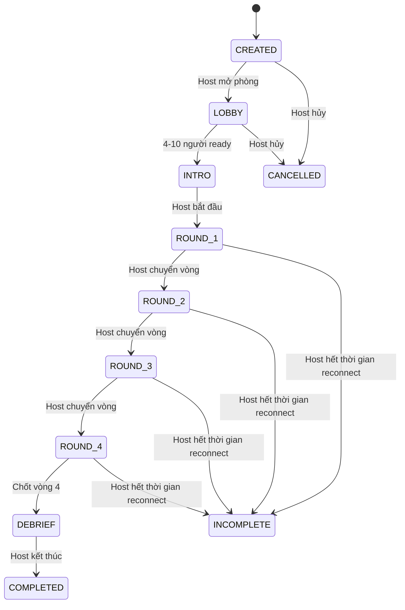
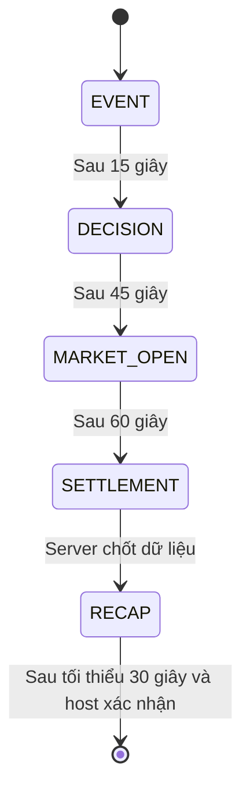
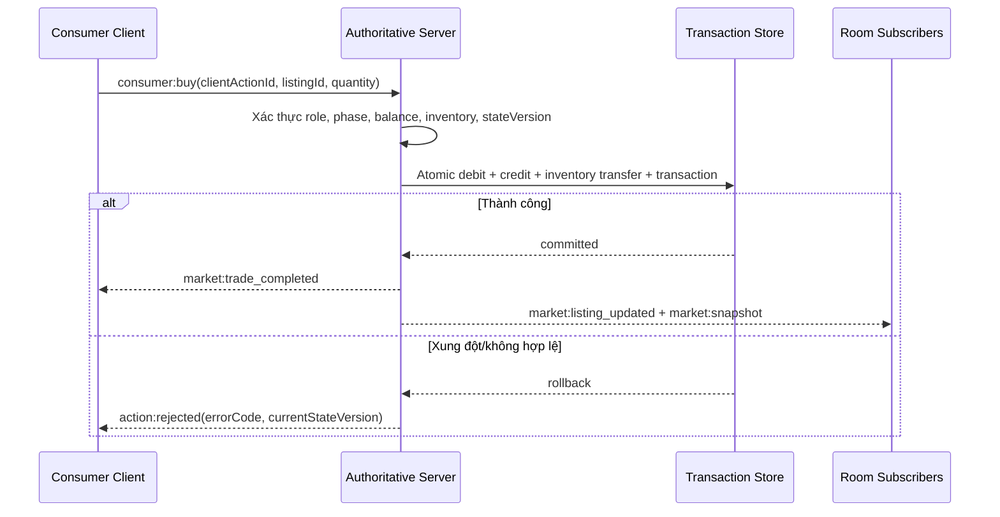

# SOFTWARE REQUIREMENTS SPECIFICATION (SRS)

## PHIÊN CHỢ GIÁ TRỊ ONLINE

**Mô phỏng đa người chơi về thị trường, quy luật giá trị và cơ chế hình thành giá cả**

---

## 0. Quản lý tài liệu

| Thuộc tính | Giá trị |
|---|---|
| Mã dự án | SPST-C2-02 |
| Tên chủ đề | Phiên chợ giá trị |
| Loại sản phẩm | Web app trải nghiệm đa người chơi thời gian thực |
| Phiên bản SRS | 1.0.0 |
| Ngày cập nhật | 24/06/2026 |
| Trạng thái | Baseline - sẵn sàng triển khai |
| Ngôn ngữ sản phẩm | Tiếng Việt |
| Tiền tệ | Đồng Việt Nam (VND), hiển thị theo nghìn Đồng |
| Tài liệu lý thuyết nguồn | `MLN122_Chuong2_Sum26.pdf` - Kinh tế Chính trị Mác-Lênin, Chương 2 |

### 0.1 Mục đích tài liệu

Tài liệu này đặc tả đầy đủ yêu cầu nghiệp vụ, luật mô phỏng, trải nghiệm người dùng, giao diện, dữ liệu, giao tiếp REST/WebSocket, yêu cầu phi chức năng và tiêu chí nghiệm thu cho web app **Phiên chợ giá trị Online**.

Sau khi SRS được phê duyệt, đội thiết kế và phát triển không phải tự quyết định thêm về:

- Phạm vi phiên bản đầu.
- Vai trò và quyền của người tham gia.
- Thứ tự và nội dung bốn vòng mô phỏng.
- Công thức giá trị, chi phí cá biệt và giá thị trường.
- Cơ chế sản xuất, niêm yết, mua ngay, trả giá và bán sỉ.
- Cách bot thay thế vai còn thiếu hoặc người mất kết nối.
- Nội dung lý thuyết phải xuất hiện trên từng khu vực UI.
- Mô hình dữ liệu, sự kiện realtime và hành vi khi có lỗi.
- Điều kiện để một yêu cầu được xem là hoàn thành.

### 0.2 Đối tượng sử dụng tài liệu

- Giảng viên và nhóm thực hiện chủ đề SPST-C2-02.
- Product owner và business analyst.
- UI/UX designer.
- Frontend, backend và realtime developer.
- QA/QC và người kiểm duyệt nội dung học thuật.
- Người thuyết trình và host vận hành phiên trải nghiệm.

### 0.3 Quy tắc trích dẫn và cơ sở yêu cầu

- Mọi số trang trong cột **Cơ sở** là số trang PDF của `MLN122_Chuong2_Sum26.pdf`, không phải số thứ tự slide in trên giao diện.
- `LT-xx` là cơ sở lý thuyết từ slide.
- `UX-xx` là suy luận thiết kế giúp người dùng quan sát hoặc thao tác với lý thuyết.
- `TECH-xx` là cơ sở kỹ thuật, bảo mật hoặc vận hành; không được gán giả tạo cho slide.
- Mỗi functional requirement phải trỏ tới ít nhất một `LT`, `UX` hoặc `TECH`.
- Các nội dung diễn giải trên UI phải dùng đúng thuật ngữ ở Mục 0.5 và không được đánh đồng giá trị với giá cả.

### 0.4 Quy ước định danh

| Tiền tố | Ý nghĩa | Ví dụ |
|---|---|---|
| `LT` | Cơ sở lý thuyết | `LT-11` |
| `LO` | Learning outcome | `LO-03` |
| `UX` | Cơ sở quyết định trải nghiệm/người dùng | `UX-FACILITATION` |
| `TECH` | Cơ sở quyết định kỹ thuật/bảo mật | `TECH-INTEGRITY` |
| `FR` | Functional requirement | `FR-MARKET-04` |
| `BR` | Business rule | `BR-VALUE-02` |
| `UI` | Màn hình hoặc thành phần UI | `UI-MAP-01` |
| `NFR` | Non-functional requirement | `NFR-RT-01` |
| `AC` | Acceptance criterion | `AC-MARKET-04` |
| `TC` | Test case cấp hệ thống | `TC-THEORY-02` |

### 0.5 Thuật ngữ bắt buộc

| Thuật ngữ | Định nghĩa sử dụng trong sản phẩm |
|---|---|
| Hàng hóa | Sản phẩm của lao động có thể thỏa mãn nhu cầu và được đưa ra trao đổi, mua bán. |
| Giá trị sử dụng | Công dụng của thùng thanh long đối với người tiêu dùng. |
| Giá trị | Lao động xã hội của người sản xuất kết tinh trong hàng hóa. |
| Hao phí lao động cá biệt | Thời gian lao động riêng của từng người sản xuất để tạo ra một đơn vị hàng hóa. |
| TGLĐXHCT | Thời gian lao động xã hội cần thiết trong điều kiện sản xuất bình thường của xã hội. |
| Chi phí cá biệt | Đại lượng gameplay quy đổi từ đầu vào cố định và hao phí lao động cá biệt; không đồng nghĩa với giá trị xã hội. |
| Giá trị xã hội | Giá trị một thùng thanh long tính từ đầu vào chuyển dịch và TGLĐXHCT của vòng. |
| Giá niêm yết | Mức giá người bán công bố; chưa phải giá thị trường nếu chưa phát sinh giao dịch. |
| Giá giao dịch | Mức giá hai bên thực sự thống nhất và thanh toán. |
| Giá thị trường | Giá bình quân gia quyền theo sản lượng của các giao dịch đã hoàn tất trong một vòng. |
| Cung | Tổng số đơn vị hàng hóa được đưa ra bán trong vòng. |
| Cầu | Tổng số đơn vị người tiêu dùng cần mua trong vòng, bao gồm cầu hệ thống hợp lệ do chính sách tạo ra. |
| Host | Người điều phối kỹ thuật và nhịp phiên chơi; không phải chủ thể Nhà nước. |
| Bot | Tác nhân hệ thống vận hành theo luật cố định, không được nhận danh hiệu. |
| Nghìn Đồng | Đơn vị rút gọn trên UI; 1 nghìn Đồng tương đương 1.000 Đồng Việt Nam. |

---

## 1. Tổng quan sản phẩm

### 1.1 Bài toán

Slide Chương 2 trình bày giá trị, giá cả, cung-cầu và bốn chủ thể thị trường bằng khái niệm, bảng và tình huống. Sản phẩm chuyển các khái niệm đó thành một phiên chợ online đồng bộ, nơi quyết định của nhiều người tạo ra dữ liệu thị trường thật để cả lớp quan sát.

Trải nghiệm phải giúp người tham gia thấy được rằng:

- Thị trường không chỉ là một địa điểm mà là tổng hòa quan hệ mua bán, xác định giá và số lượng (`LT-07`).
- Giá trị dựa trên TGLĐXHCT; thời gian cá biệt của một người không tự quyết định giá trị xã hội (`LT-04`).
- Cung-cầu tác động trực tiếp đến giá cả, không tạo ra giá trị (`LT-09`, `LT-11`).
- Giá cả có thể cao hơn, thấp hơn hoặc xấp xỉ giá trị (`LT-09`, `LT-11`).
- Quy luật giá trị điều tiết sản xuất, kích thích cải tiến và phân hóa người sản xuất (`LT-10`).
- Người sản xuất, người tiêu dùng, trung gian và Nhà nước có vai trò khác nhau (`LT-13`).

### 1.2 Mục tiêu sản phẩm

- Tổ chức một phiên trải nghiệm đồng bộ cho 4-10 người chơi và một host.
- Cho người chơi tạo ra cung, cầu và giá giao dịch bằng quyết định thật.
- Hiển thị đồng thời giá trị xã hội và giá thị trường, tuyệt đối không dùng lẫn hai đại lượng.
- Tạo bốn vòng có chủ đích: cơ sở, dư cung, tăng cầu và tăng năng suất xã hội.
- Kết thúc bằng một báo cáo dùng chính dữ liệu phiên để giải thích lý thuyết.
- Lưu kết quả để người chơi và host xem lại sau phiên.

### 1.3 Learning outcomes

| ID | Sau trải nghiệm, người tham gia có thể | Cơ sở |
|---|---|---|
| `LO-01` | Phân biệt giá trị sử dụng, giá trị, chi phí cá biệt, giá niêm yết và giá thị trường. | `LT-01`, `LT-02`, `LT-04`, PDF trang 11-17, 30-31 |
| `LO-02` | Giải thích vì sao TGLĐXHCT, không phải thời gian cá biệt, là cơ sở xác định giá trị. | `LT-04`, PDF trang 28, 30-31 |
| `LO-03` | Giải thích vì sao cung lớn hơn cầu thường làm giá giảm và cung nhỏ hơn cầu thường làm giá tăng. | `LT-11`, PDF trang 86 |
| `LO-04` | Giải thích giá cả dao động quanh trục giá trị. | `LT-09`, PDF trang 81-82 |
| `LO-05` | Nhận diện ba tác động của quy luật giá trị qua kết quả của nhà sản xuất. | `LT-10`, PDF trang 83-85 |
| `LO-06` | Mô tả vai trò của bốn chủ thể trong xử lý tình huống được mùa-mất giá. | `LT-13`, `LT-14`, PDF trang 89-91 |

### 1.4 Tiêu chí thành công sản phẩm

- Một host có thể tạo và hoàn tất phiên 4-10 người trong 15-20 phút.
- Tất cả giao dịch, số dư và tồn kho được xử lý nhất quán, không âm và không ghi trùng.
- Mỗi vòng tạo được snapshot gồm cung, cầu, giá trị, giao dịch, giá thị trường và hàng tồn.
- Báo cáo cuối phiên dùng dữ liệu thật, không chỉnh giá để ép kết quả giống lý thuyết.
- 100% thành phần UI có nội dung kinh tế phải truy vết được tới `LT` tương ứng.
- Không sử dụng tiền hư cấu; mọi giá trị tiền tệ dùng VND và trình bày theo nghìn Đồng.

### 1.5 Trong phạm vi

- Tài khoản Google và email/mật khẩu.
- Hồ sơ, avatar, lịch sử cá nhân và xóa tài khoản.
- Tạo phòng, mã phòng, QR, lobby, ready và phân vai.
- Một scenario chuẩn, một hàng hóa là thùng thanh long.
- Bản đồ chợ 2D tĩnh và avatar hiện diện theo vai.
- Bốn vai thị trường và host riêng biệt.
- Sản xuất, bán trực tiếp, bán sỉ, niêm yết, mua ngay, offer và counter.
- Bốn chính sách Nhà nước được định nghĩa trước.
- Bot cho vai thiếu và takeover khi mất kết nối.
- Biểu đồ realtime, tổng kết vòng, debrief và lịch sử.

### 1.6 Ngoài phạm vi

- Nhiều loại hàng hóa hoặc chuyển nguồn lực giữa nhiều ngành.
- Giá trị thặng dư như một nội dung độc lập của Chương 3.
- Bản đồ đi lại tự do, vật lý va chạm hoặc game 3D.
- Chat, voice chat và nội dung tự do do người dùng đăng.
- Host tự tạo biến cố, tự chỉnh hệ số kinh tế hoặc thay thứ tự vòng.
- Quiz, thi chấm điểm, chứng chỉ hoặc bảng xếp hạng chung.
- Chế độ cá nhân với toàn bộ đối thủ là bot.
- Trang quản trị nội dung riêng.
- Thanh toán thật, nạp/rút tiền hoặc quy đổi phần thưởng.

### 1.7 Giả định vận hành

- Người chơi có tài khoản và thiết bị có trình duyệt; host dùng màn hình desktop/projector.
- Host không chiếm một trong 4-10 ghế người chơi và không kiêm vai thị trường trong phiên.
- Người chơi hiểu các thao tác web cơ bản; UI cung cấp hướng dẫn ngắn theo ngữ cảnh.
- Kết quả giá phụ thuộc hành vi người chơi; quan hệ lý thuyết là xu hướng, không phải giá được hệ thống cưỡng ép.

---

## 2. Cơ sở lý thuyết và truy vết sang sản phẩm

### 2.1 Danh mục lý thuyết

| ID | Nội dung chuẩn từ slide | Suy luận sản phẩm | Biểu hiện gameplay/UI | Yêu cầu liên quan |
|---|---|---|---|---|
| `LT-01` | Hàng hóa là sản phẩm của lao động, thỏa mãn nhu cầu thông qua trao đổi, mua bán. PDF trang 11. | Thanh long chỉ trở thành hàng hóa trong mô phỏng khi được đưa vào kho bán/niêm yết. | Commodity card mô tả công dụng và trạng thái “đã đưa ra thị trường”. | `FR-GAME-04`, `UI-COMMODITY-01` |
| `LT-02` | Hàng hóa có giá trị sử dụng và giá trị; người bán quan tâm thực hiện giá trị, người mua quan tâm công dụng. PDF trang 12-17. | Người tiêu dùng nhận lợi ích khi nhu cầu được đáp ứng; người sản xuất nhận doanh thu khi bán. | Card hàng hóa có hai vùng “Công dụng” và “Lao động xã hội”; recap so sánh mục tiêu hai phía. | `FR-CONSUMER-05`, `UI-COMMODITY-01` |
| `LT-03` | Lao động cụ thể tạo giá trị sử dụng; lao động trừu tượng tạo giá trị; lao động tư nhân có thể không được xã hội thừa nhận nếu hàng không bán được. PDF trang 24-28. | Sản xuất tạo hàng nhưng hàng tồn cuối vòng cho thấy lao động cá biệt chưa được thị trường thừa nhận. | Hàng hỏng/tồn được nêu trong recap, không bị xóa âm thầm. | `FR-PRODUCER-06`, `UI-RECAP-02` |
| `LT-04` | Lượng giá trị đo bằng TGLĐXHCT; thường tiệm cận thời gian của nhóm cung cấp đại bộ phận hàng hóa. PDF trang 30-31. | Scenario có trục TGLĐXHCT riêng, không dùng thời gian riêng của một người làm giá trị xã hội. | Labor card đặt “hao phí cá biệt” cạnh “mức xã hội”, có giải thích thắng/hòa/thiệt. | `BR-VALUE-01` đến `BR-VALUE-04`, `UI-LABOR-01` |
| `LT-05` | Giá trị gồm đầu vào chuyển dịch và giá trị mới; năng suất tăng làm giá trị một đơn vị giảm, cường độ tăng không làm đổi giá trị đơn vị. PDF trang 32-36. | Công thức gồm `c` cố định và phần lao động; vòng 4 giảm TGLĐXHCT do công nghệ phổ biến. Không có nút “tăng cường độ” làm giảm giá trị. | Formula tooltip và animation trục giá trị từ 10 xuống 6 nghìn Đồng. | `BR-VALUE-01`, `BR-ROUND-04`, `UI-OBSERVATORY-03` |
| `LT-06` | Tiền là thước đo giá trị và phương tiện lưu thông; giá trị biểu hiện thành giá cả. PDF trang 50-53. | VND biểu hiện giá niêm yết/giao dịch và trung gian trong mua bán. | Ví Đồng, tooltip “thước đo giá trị/phương tiện lưu thông”; không dùng tiền hư cấu. | `BR-MONEY-01` đến `BR-MONEY-05`, `UI-WALLET-01` |
| `LT-07` | Thị trường là tổng hòa quan hệ kinh tế qua trao đổi, xác định giá cả và số lượng; cơ chế thị trường tự điều chỉnh qua các quy luật. PDF trang 66-69. | Bản đồ chỉ là lớp trình bày; market state, listing, offer và transaction mới là thị trường. | Market observatory hiển thị quan hệ giữa người chơi, số lượng và giá. | `FR-MARKET-*`, `UI-MAP-01` |
| `LT-08` | Thị trường tạo động lực và phân bổ nguồn lực nhưng có khuyết tật; Nhà nước quản lý và khắc phục khuyết tật. PDF trang 71-76. | Nhà nước có dữ liệu tổng hợp, ngân sách hữu hạn và chính sách; không trực tiếp ấn định giá. | Policy console hiển thị chi phí, tác dụng và đánh đổi. | `FR-STATE-*`, `UI-STATE-01` |
| `LT-09` | Sản xuất/trao đổi dựa trên TGLĐXHCT; giá cả lên xuống nhưng xoay quanh giá trị. PDF trang 81-82. | Giá trị là đường riêng; giá thị trường chỉ tính từ giao dịch thật. | Đồ thị hai đường, có khoảng trống khi không hình thành giá. | `BR-PRICE-*`, `UI-OBSERVATORY-01` |
| `LT-10` | Quy luật giá trị điều tiết sản xuất/lưu thông, kích thích cải tiến và phân hóa người sản xuất. PDF trang 83-85. | Người chơi đổi sản lượng, đầu tư công nghệ và nhận lợi nhuận khác nhau theo hao phí cá biệt. | Producer recap có ba callout tương ứng ba tác động. | `FR-PRODUCER-*`, `UI-RECAP-03` |
| `LT-11` | Cung lớn hơn cầu: giá có xu hướng giảm; cung nhỏ hơn cầu: giá có xu hướng tăng; cân bằng: giá xấp xỉ giá trị. PDF trang 86. | Vòng 2 tăng cung, vòng 3 tăng cầu nhưng không ghi đè giá do con người quyết định. | Supply-demand meter và card “xu hướng lý thuyết/điều đã xảy ra”. | `BR-ROUND-02`, `BR-ROUND-03`, `UI-SUPPLY-DEMAND-01` |
| `LT-12` | Cạnh tranh thúc đẩy cải tiến, nâng chất lượng, hạ giá nhưng có thể gây tác động tiêu cực. PDF trang 88. | Nhiều listing cạnh tranh bằng giá; giới hạn server ngăn gian lận, bán vượt kho. | Danh sách quầy có cùng thông tin để so sánh; không ưu tiên bí mật người bán. | `FR-MARKET-02`, `FR-MARKET-07` |
| `LT-13` | Bốn chủ thể gồm người sản xuất, người tiêu dùng, trung gian và Nhà nước. PDF trang 89-90. | Bốn role module có quyền, dữ liệu và mục tiêu khác nhau. Host không phải Nhà nước. | Bốn khu bản đồ và role dashboard riêng. | `FR-PRODUCER-*`, `FR-CONSUMER-*`, `FR-INTERMEDIARY-*`, `FR-STATE-*` |
| `LT-14` | Tình huống được mùa-mất giá cần phối hợp điều chỉnh sản xuất, tiêu dùng, phân phối, thông tin và xúc tiến. PDF trang 91, 94. | Vòng 2 là tình huống trung tâm; recap gom hành động của bốn chủ thể. | Event banner “Được mùa” và debrief theo bốn vai. | `BR-ROUND-02`, `UI-RECAP-04` |

### 2.2 Các rào chắn học thuật

1. UI không được viết “cung-cầu quyết định giá trị”; phải viết “cung-cầu tác động trực tiếp tới giá cả”.
2. UI không được lấy giá niêm yết làm giá thị trường.
3. UI không được lấy thời gian cá biệt của một người làm TGLĐXHCT.
4. UI phải giải thích vòng 2 giữ nguyên giá trị để cô lập tác động cung-cầu trong ngắn hạn.
5. UI phải giải thích người tiên phong có chi phí thấp hơn nhưng chưa làm trục giá trị xã hội đổi ngay.
6. Vòng 4 chỉ đổi trục giá trị khi công nghệ mới được scenario xác định là phổ biến.
7. Tăng cường độ lao động không được dùng làm upgrade giảm giá trị đơn vị.
8. Nhà nước không được có nút nhập giá hoặc khóa giá thị trường trong phiên bản này.

### 2.3 Danh mục cơ sở UX

| ID | Quyết định trải nghiệm được bảo vệ |
|---|---|
| `UX-CORRECTION` | Cho phép sửa quyết định khi chưa gây tác động thị trường để giảm lỗi thao tác, nhưng khóa khi đã tạo cam kết với người khác. |
| `UX-ENTRY` | Đặt tạo phòng, nhập mã và lịch sử ở trang đầu để giảm số bước tham gia. |
| `UX-FACILITATION` | Tách host khỏi vai Nhà nước và cung cấp timer/control riêng để host điều phối mà không làm méo kết quả thị trường. |
| `UX-FAIRNESS` | Mọi người chơi tuân thủ cùng deadline, giới hạn tiền/kho và quy tắc offer. |
| `UX-HISTORY` | Lưu kết quả để người chơi xem lại mối liên hệ giữa quyết định và dữ liệu thị trường. |
| `UX-IDENTITY` | Dùng display name/avatar trong phòng, không dùng email làm danh tính công khai. |
| `UX-LEARNING` | Hiển thị giải thích đúng ngữ cảnh nhưng không đưa khuyến nghị mua/bán làm thay quyết định người chơi. |
| `UX-LEARNING-SEQUENCE` | Bốn vòng cố định đi từ mốc cơ sở đến cung, cầu và năng suất để mỗi biến được quan sát riêng. |
| `UX-MEASUREMENT` | Chỉ dùng dữ liệu giao dịch đã hoàn tất cho chỉ số giá thị trường. |
| `UX-MOTIVATION` | Dùng danh hiệu theo vai, không xếp hạng chung các mục tiêu không đồng nhất. |
| `UX-ROLE` | Role card nói rõ thông tin, quyền và mục tiêu để người chơi không nhầm host với Nhà nước hoặc trung gian với người sản xuất. |
| `UX-SESSION` | Giới hạn 4-10 người và auto-assign để phiên bắt đầu nhanh nhưng vẫn có cạnh tranh ở hai phía. |
| `UX-USABILITY` | Dùng bước giá 1 nghìn Đồng để thao tác nhanh trên điện thoại và tránh số lẻ khó đọc. |

### 2.4 Danh mục cơ sở kỹ thuật

| ID | Quyết định kỹ thuật được bảo vệ |
|---|---|
| `TECH-AUDIT` | Lưu scenario version, ledger và snapshot để dựng lại kết quả và kiểm tra sai lệch. |
| `TECH-AUTH` | Xác thực Google/email, email verification, reset và liên kết identity an toàn. |
| `TECH-BOT` | Bot tiếp quản dựa trên state hiện tại và cùng quyền role để phiên không bị treo. |
| `TECH-IDEMPOTENCY` | Mỗi mutation có client action ID để retry không tạo giao dịch hoặc cấp tiền trùng. |
| `TECH-INTEGRITY` | Server-authoritative, transaction nguyên tử và invariant không âm bảo vệ tiền/kho. |
| `TECH-LEDGER` | Mọi biến động tiền có ledger entry đối ứng và truy vết được. |
| `TECH-LIFECYCLE` | Room/session có trạng thái và thời hạn rõ để code phòng không tồn tại vô hạn. |
| `TECH-MONEY` | Tiền lưu bằng integer VND, không dùng floating point. |
| `TECH-PRIVACY` | Tách dữ liệu xác thực khỏi public participant/session payload. |
| `TECH-REALTIME` | WebSocket phát delta có version; snapshot giúp client hội tụ khi bỏ lỡ event. |
| `TECH-RECONNECT` | Membership bền qua mất mạng; bot takeover/reclaim không tạo participant mới. |
| `TECH-SESSION` | Room code, capacity, membership và join policy được kiểm tra server-side. |
| `TECH-STATE-MACHINE` | Chỉ cho phép transition hợp lệ để không skip vòng hoặc mutation sai phase. |
| `TECH-TIMER` | Timer do server quyết định, hỗ trợ pause/extend mà không phụ thuộc clock client. |
| `TECH-VALIDATION` | Server xác thực schema, miền giá trị và quyền sở hữu trước mọi mutation. |

---

## 3. Tác nhân và quyền

### 3.1 Tác nhân hệ thống

| Tác nhân | Mục tiêu | Không được làm |
|---|---|---|
| Người dùng đã xác thực | Quản lý hồ sơ, tạo hoặc tham gia phiên, xem lịch sử. | Truy cập dữ liệu riêng của người khác. |
| Host | Điều phối nhịp phiên và trình chiếu dữ liệu chung. | Giao dịch, chỉnh tiền, chỉnh scenario hoặc đóng vai Nhà nước. |
| Người sản xuất | Sản xuất và bán với lợi nhuận hợp lý. | Tạo hàng vượt công suất/vốn; sửa giao dịch đã chốt. |
| Người tiêu dùng | Đáp ứng nhu cầu với chi phí phù hợp. | Mua vượt số dư; tạo cầu ngoài need card. |
| Trung gian | Kết nối sản xuất-tiêu dùng, mua sỉ và bán lẻ. | Bán hàng chưa sở hữu; chi vượt số dư. |
| Nhà nước | Quan sát tổng thể và dùng chính sách khắc phục vấn đề. | Xem chiến lược riêng; trực tiếp đặt giá. |
| Bot | Duy trì vai còn thiếu hoặc takeover nhất quán. | Nhận danh hiệu, thay luật hoặc có thông tin ngoài quyền của vai. |
| Server | Nguồn sự thật cho state, tiền, kho, timer, giao dịch và điểm. | Tin dữ liệu tính toán tiền/điểm từ client. |

### 3.2 Phân bổ vai

| Số người chơi | Sản xuất | Tiêu dùng | Trung gian | Nhà nước |
|---:|---:|---:|---:|---:|
| 4 | 2 | 2 | Bot | Bot |
| 5 | 2 | 2 | 1 | Bot |
| 6 | 2 | 2 | 1 | 1 |
| 7 | 3 | 2 | 1 | 1 |
| 8 | 3 | 3 | 1 | 1 |
| 9 | 4 | 3 | 1 | 1 |
| 10 | 4 | 4 | 1 | 1 |

Quy tắc:

- Host không nằm trong bảng và không tính vào `maxPlayers`.
- Auto-assign ưu tiên đúng bảng trên.
- Host được đổi vai giữa các người chơi trong lobby, nhưng tổng số mỗi vai phải giữ đúng bảng.
- Sau khi vào `INTRO`, role assignment bị khóa.
- Bot được tạo cho vai thiếu; bot không tính vào số người chơi.
- Khi người chơi mất kết nối đủ 15 giây, bot takeover đúng role state hiện tại.

### 3.3 Phân bổ hồ sơ năng suất

| Số người sản xuất | Hồ sơ được cấp theo thứ tự |
|---:|---|
| 2 | Truyền thống, Tiên phong |
| 3 | Truyền thống, Trung bình xã hội, Tiên phong |
| 4 | Truyền thống, Trung bình xã hội, Trung bình xã hội, Tiên phong |

Việc phân bổ hồ sơ không dùng để xếp hạng chung. Dashboard phải giải thích đây là điều kiện ban đầu khác nhau nhằm quan sát sự phân hóa (`LT-10`).

---

## 4. Vòng đời và thời gian phiên

### 4.1 State machine cấp phiên



### 4.2 State machine mỗi vòng



### 4.3 Thời lượng mục tiêu

| Hạng mục | Thời lượng |
|---|---:|
| Lobby và kiểm tra kết nối | 2 phút |
| Intro và hướng dẫn vai | 2 phút |
| 4 vòng x 2 phút 30 giây | 10 phút |
| Debrief cuối phiên | 3-5 phút |
| Tổng | 17-19 phút |

Host có thể pause/resume bất kỳ phase nào và gia hạn phase hiện tại đúng 30 giây mỗi lần. Mỗi phase chỉ được gia hạn tối đa hai lần.

### 4.4 Gia nhập và rời phiên

- Người chơi chỉ được lấy ghế mới khi session ở `LOBBY`.
- Sau `INTRO`, account chưa có `Participant` không được late join.
- Account đã có ghế được reconnect và nhận snapshot mới nhất.
- Rời lobby giải phóng ghế; rời sau intro giữ ghế cho reconnect/bot takeover.
- Một account chỉ có một participant trong một session.
- Nếu cùng account mở nhiều tab, tab kết nối mới nhất là tab điều khiển; tab cũ chuyển read-only và nhận thông báo.

---

## 5. Scenario và luật kinh tế

### 5.1 Scenario mặc định

| Cấu hình | Giá trị |
|---|---:|
| `scenarioVersion` | `dragon-fruit-v1` |
| Hàng hóa | 1 thùng thanh long |
| `inputTransferredValueVnd` | 2.000 |
| `laborValueRateVnd` | 4.000/đơn vị thời gian |
| `socialLaborTime` vòng 1-3 | 2 |
| `socialLaborTime` vòng 4 | 1 |
| `unitValueVnd` vòng 1-3 | 10.000 |
| `unitValueVnd` vòng 4 | 6.000 |
| Vốn đầu kỳ người sản xuất | 50.000/người |
| Trợ cấp ngân sách người tiêu dùng | 20.000/người/vòng |
| Vốn đầu kỳ trung gian | 60.000 |
| Ngân sách đầu kỳ Nhà nước | 40.000 |
| Lao động khả dụng người sản xuất | 8 điểm/vòng |
| Trần sản lượng bình thường | 4 thùng/người/vòng |
| Giá hợp lệ | 1.000-30.000, bước 1.000 |
| Lợi ích một đơn vị đáp ứng nhu cầu | 20.000 điểm quy đổi |

Các hằng số nằm trong `ScenarioConfig`, không hard-code rải rác trong client. Người dùng và host không có quyền sửa.

### 5.2 Tiền tệ

#### 5.2.1 Quy ước hiển thị

- Tiền tệ là Đồng Việt Nam, mã `VND`.
- UI chính hiển thị theo nghìn Đồng: `10 nghìn Đồng`.
- Tooltip/chi tiết hiển thị: `10.000 Đồng`.
- Không sử dụng tên, ký hiệu hoặc biểu tượng tiền hư cấu khiến người dùng hiểu đây là tiền khác VND.

#### 5.2.2 Quy ước lưu trữ

```text
10 nghìn Đồng -> amountVnd = 10000
6 nghìn Đồng  -> amountVnd = 6000
```

- Tất cả trường tiền là integer VND.
- Không dùng floating point cho tiền.
- Mọi giá gameplay là bội số của 1.000 VND.
- Phép chia dùng cho giá thị trường giữ độ chính xác nội bộ; UI làm tròn tới 1.000 VND gần nhất theo quy tắc half-up.

### 5.3 Giá trị xã hội và chi phí cá biệt

```text
unitValueVnd = inputTransferredValueVnd
             + socialLaborTime * laborValueRateVnd
```

Vòng 1-3:

```text
2.000 + 2 * 4.000 = 10.000 Đồng
```

Vòng 4:

```text
2.000 + 1 * 4.000 = 6.000 Đồng
```

```text
individualUnitCostVnd = inputTransferredValueVnd
                      + individualLaborTime * laborValueRateVnd
```

| Hồ sơ | `individualLaborTime` | `individualUnitCostVnd` | Công suất từ 8 điểm lao động |
|---|---:|---:|---:|
| Truyền thống | 4 | 18.000 | 2 |
| Trung bình xã hội | 2 | 10.000 | 4 |
| Tiên phong | 1 | 6.000 | 4, bị chặn bởi trần sản lượng |

### 5.4 Đầu tư công nghệ

- Người sản xuất Truyền thống có thể trả 12.000 VND để chuyển về Trung bình xã hội từ vòng kế tiếp.
- Người sản xuất Trung bình xã hội có thể trả 16.000 VND để chuyển thành Tiên phong từ vòng kế tiếp.
- Tiên phong không có upgrade tiếp theo.
- Upgrade làm giảm chi phí cá biệt của người đầu tư nhưng không tự đổi `socialLaborTime`.
- Chính sách hỗ trợ công nghệ giảm 50% chi phí của đúng một upgrade được chọn.
- Vòng 4 là sự kiện công nghệ phổ biến: mọi người sản xuất còn hoạt động được đặt `individualLaborTime = 1`; `socialLaborTime = 1`; không nhận đầu tư mới.

### 5.5 Sản xuất

```text
capacityByLabor = floor(availableLaborPoints / individualLaborTime)
allowedQuantity = min(capacityByLabor, roundProductionCap,
                      floor(balanceVnd / individualUnitCostVnd))
```

- Người sản xuất chọn số nguyên từ 0 đến `allowedQuantity`.
- Chi phí sản xuất bị trừ khi server xác nhận lệnh sản xuất.
- Hàng được thêm vào inventory của vòng và chưa là cung cho tới khi niêm yết/bán sỉ.
- Hủy quyết định chỉ được phép trong `DECISION` và trước khi tạo listing/wholesale; server hoàn tiền và thu hồi hàng trong cùng transaction.
- Khi `MARKET_OPEN` bắt đầu, quyết định sản xuất bị khóa.

### 5.6 Giá thị trường

```text
marketPriceNumeratorVndUnits = sum(transactionPriceVnd * quantity)
marketPriceDenominatorUnits  = sum(quantity)
exactMarketPrice             = marketPriceNumeratorVndUnits
                             / marketPriceDenominatorUnits
```

- Chỉ transaction trạng thái `COMPLETED` trong đúng vòng và có channel `RETAIL_DIRECT`, `RETAIL_INTERMEDIARY` hoặc `SYSTEM_EXPORT` được tính.
- Giá dùng bình quân gia quyền theo số thùng.
- Nếu không có transaction, `marketPriceVnd = null` và UI ghi “Không hình thành giá”.
- Giá niêm yết, offer bị từ chối và transaction channel `WHOLESALE` không được dùng làm giá bán lẻ thị trường. Giao dịch bán sỉ được báo cáo riêng.
- Snapshot giữ tử số và mẫu số nguyên để kiểm tra chính xác, không lưu tiền dưới dạng floating point.
- `marketPriceVnd` là kết quả `exactMarketPrice` làm tròn half-up tới 1.000 VND gần nhất.

### 5.7 Bốn vòng cố định

| Vòng | Tên | Thay đổi hệ thống | Cơ sở và mục tiêu UI |
|---:|---|---|---|
| 1 | Thị trường cơ sở | Cấu hình bình thường; giá trị 10.000 VND. | Thiết lập mốc so sánh; `LT-07`, `LT-09`. |
| 2 | Được mùa | Điểm lao động khả dụng và trần sản lượng của mỗi nhà sản xuất tăng 50%, làm tròn lên; chi phí và giá trị trên mỗi đơn vị giữ nguyên. | Tăng năng lực đưa hàng ra thị trường mà không đổi hao phí trên một đơn vị, tạo khả năng dư cung trong ngắn hạn; giải thích cung-cầu làm giá biến động, không tạo giá trị; `LT-11`, `LT-14`. |
| 3 | Thanh long viral | Tổng need target tăng 50%, làm tròn lên; hệ thống phân bổ các need bổ sung lần lượt cho người tiêu dùng có ít need nhất. | Tạo khả năng cầu lớn hơn cung; `LT-11`. |
| 4 | Công nghệ phổ biến | Mọi người sản xuất về `individualLaborTime = 1`; TGLĐXHCT về 1; giá trị từ 10.000 xuống 6.000 VND. | Thể hiện năng suất tăng làm giá trị đơn vị giảm; `LT-05`, `LT-10`. |

Thông số cụ thể vòng 2 là `availableLaborPoints = ceil(8 * 1.5) = 12` và `roundProductionCap = ceil(4 * 1.5) = 6`. Đây là tăng quy mô nguồn lực có thể huy động và lượng hàng có thể đưa ra thị trường; `individualLaborTime`, `individualUnitCostVnd`, `socialLaborTime` và `unitValueVnd` không đổi trong vòng này. Sản lượng thực tế vẫn do lựa chọn và số dư của người sản xuất quyết định.

Giá thực tế không bị ép tăng/giảm. Recap đặt cạnh nhau: “Xu hướng lý thuyết” và “Dữ liệu phiên”, đồng thời giải thích nếu hành vi người chơi làm kết quả khác xu hướng.

### 5.8 Hàng tồn và hư hỏng

- Cuối `MARKET_OPEN`, offer mở hết hạn trước settlement.
- Hàng chưa bán thuộc người sản xuất hoặc trung gian được đánh dấu `AT_RISK`.
- Không có chính sách kho lạnh: toàn bộ `AT_RISK` chuyển `SPOILED`, giá trị thu hồi bằng 0.
- Có kho lạnh: tối đa số lượng được chính sách bảo vệ chuyển thành `CARRIED`, ưu tiên lot do Nhà nước đã chọn; phần còn lại hỏng.
- Hàng `CARRIED` có thể niêm yết ở vòng sau; không phát sinh lại chi phí sản xuất.

### 5.9 Điểm và danh hiệu

#### Người sản xuất

```text
producerProfitVnd = endingBalanceVnd - 50000
```

Chi phí sản xuất/đầu tư đã phản ánh trong balance. Hàng tồn cuối phiên không được định giá lại.

#### Người tiêu dùng

```text
consumerUtilityVnd = fulfilledRequiredUnits * 20000
                   - totalRetailSpendingVnd
```

Mọi đơn vị mua được ưu tiên lấp need chưa hoàn thành. Đơn vị mua vượt nhu cầu không tạo lợi ích nhưng toàn bộ số tiền mua, kể cả mua dư, vẫn bị trừ trong công thức utility.

#### Trung gian

```text
intermediaryProfitVnd = endingBalanceVnd - 60000
```

Dashboard bổ sung `connectedProducerCount`, `connectedConsumerCount` và `spoiledQuantity`.

#### Nhà nước

```text
socialScore = 2 * completedRetailQuantity
            + round(10 * consumerFulfillmentRate)
            - 2 * spoiledQuantity
            - 5 * insolventProducerCount
            - floor(policySpendVnd / 1000)
```

#### Danh hiệu

- “Nhà sản xuất hiệu quả”: lợi nhuận cao nhất trong role, tie-break bằng tỷ lệ bán được.
- “Người tiêu dùng thông thái”: đã đáp ứng toàn bộ need và có giá mua bình quân thấp nhất.
- “Cầu nối thị trường”: trung gian có ít nhất một giao dịch sỉ, một giao dịch lẻ và lợi nhuận không âm.
- “Điều tiết cân bằng”: Nhà nước có `socialScore > 0` và không vượt ngân sách.
- Bot không nhận danh hiệu; không có leaderboard liên vai.

### 5.10 Chính sách Nhà nước

| Chính sách | Thời điểm | Chi phí | Hiệu lực |
|---|---|---:|---|
| Công bố thông tin | 15 giây đầu `DECISION` | 3.000 | Hiện chính xác tổng cầu mục tiêu, thay cho chỉ báo thấp/bình thường/cao. |
| Kho lạnh | `DECISION`, tác dụng tại settlement | 2.000/thùng, tối đa 3 thùng và không vượt ngân sách | Nhà nước chọn lot được bảo vệ; hàng chuyển sang vòng sau. |
| Xúc tiến xuất khẩu | 15 giây đầu `MARKET_OPEN` | 4.000 cố định + giá mua thực tế | Tạo system buyer cần `ceil(totalRetailSupply * 0.25)` thùng, giá mua tối đa bằng `unitValueVnd`, dừng khi đạt target hoặc hết ngân sách. |
| Hỗ trợ công nghệ | `DECISION`, vòng 2 hoặc 3 | 8.000 | Chọn một producer; upgrade kế tiếp của họ được giảm 50%. Không cộng dồn. |

- Mỗi vòng từ vòng 2 chỉ được áp dụng tối đa một chính sách.
- Chọn “Không can thiệp” là hợp lệ và không tốn ngân sách.
- Producer input bị khóa tối đa 15 giây đầu `DECISION` để Nhà nước chọn Công bố thông tin/Hỗ trợ công nghệ; sau thời gian này hệ thống mở input dù Nhà nước chưa chọn.
- Chính sách thất bại do thiếu ngân sách không tiêu tiền và không tính là đã dùng lượt.
- System buyer của Xúc tiến xuất khẩu duyệt listing có `askPriceVnd <= unitValueVnd` theo giá tăng dần, tie-break bằng thời điểm tạo sớm hơn; mua tại đúng ask price và ghi transaction channel `SYSTEM_EXPORT`.
- Chi phí mua của system buyer trừ trực tiếp ngân sách Nhà nước và được tính vào `policySpendVnd`; transaction `SYSTEM_EXPORT` tham gia giá thị trường vì là hàng thực sự được bán ở mức giá đã trả.

---

## 6. Cơ chế giao dịch

### 6.1 Kênh trực tiếp

1. Người bán chọn inventory, số lượng và `askPriceVnd`.
2. Server tạo listing và chuyển đúng số lượng sang trạng thái reserved-for-listing.
3. Người mua có thể mua ngay hoặc gửi offer.
4. Người bán accept, reject hoặc counter.
5. Người mua chấp nhận counter hoặc để offer hết hạn.
6. Server hoàn tất giao dịch nguyên tử: trừ tiền, cộng tiền, chuyển hàng, giảm listing, ghi transaction và phát event.

### 6.2 Kênh bán sỉ qua trung gian

1. Producer tạo wholesale offer gồm quantity và minimum wholesale price.
2. Intermediary accept, reject hoặc counter.
3. Producer chấp nhận counter nếu có.
4. Khi chốt, trung gian thanh toán ngay và sở hữu inventory.
5. Trung gian tạo retail listing và chịu rủi ro tồn/hỏng.
6. Wholesale transaction được lưu riêng và không tham gia `marketPriceVnd` bán lẻ.

### 6.3 Sequence giao dịch mua ngay



### 6.4 Quy tắc toàn vẹn

- Giá hợp lệ từ 1.000 đến 30.000 VND, bước 1.000 VND.
- Quantity là integer dương và không vượt số lượng khả dụng.
- Không cho balance âm hoặc inventory âm.
- Một unit inventory chỉ thuộc một owner và tối đa một active listing/wholesale reservation.
- Một consumer có tối đa một offer `OPEN` trên cùng listing.
- Offer có thời hạn tới cuối `MARKET_OPEN`; counter kế thừa cùng hạn.
- Buy-now cạnh tranh cho unit cuối dùng database transaction/lock; chỉ một request thành công.
- `clientActionId` duy nhất theo participant; gửi lại cùng ID trả kết quả cũ, không xử lý lần hai.
- Mọi mutation kiểm tra `stateVersion`; client cũ nhận `STALE_STATE` và snapshot delta/full mới.
- Transaction `COMPLETED` là bất biến; hoàn tác chỉ qua compensating transaction dành cho lỗi vận hành, không có UI cho host.

---

## 7. Kiến trúc thông tin và UI/UX

### 7.1 Nguyên tắc giao diện

- Mobile-first cho người chơi, desktop/projector-first cho host.
- Bản đồ 2D tạo cảm giác cùng hiện diện nhưng không có di chuyển tự do.
- Global HUD luôn hiện: vòng, phase, timer, event, role, trạng thái kết nối và ví.
- Nội dung lý thuyết xuất hiện đúng thời điểm, không che thao tác chính.
- Màu không là tín hiệu duy nhất; mọi trạng thái có text/icon/pattern.
- Mọi số tiền chính hiển thị dạng `10 nghìn Đồng`; tooltip/aria-label đọc `10.000 Đồng`.

### 7.2 Bản đồ chợ 2D

| Khu | Vai trò chính | Chức năng | Cơ sở |
|---|---|---|---|
| Nông trại/Xưởng | Producer | Sản xuất, công nghệ, chi phí cá biệt. | `LT-03`, `LT-04`, `LT-05` |
| Quầy bán trực tiếp | Producer, Consumer | Listing, so sánh, mua và trả giá. | `LT-07`, `LT-11`, `LT-12` |
| Trung tâm phân phối | Intermediary | Mua sỉ, bán lẻ, kết nối hai phía. | `LT-13` |
| Văn phòng Nhà nước | State | Dữ liệu tổng hợp, ngân sách và chính sách. | `LT-08`, `LT-13` |
| Tháp quan sát | Tất cả/Host | Cung, cầu, giá trị, giá thị trường, giao dịch. | `LT-09`, `LT-11` |

Avatar đứng cố định trong khu role, có nickname, role badge, online/offline/bot badge. Click avatar chỉ mở public role summary, không lộ email, balance hoặc chiến lược riêng.

### 7.3 Danh mục màn hình

| ID | Màn hình | Người dùng | Dữ liệu/hành động chính | Trạng thái bắt buộc | Cơ sở |
|---|---|---|---|---|---|
| `UI-AUTH-01` | Đăng nhập/đăng ký | Tất cả | Google, email/password, verify, reset. | Loading, invalid credentials, unverified, provider conflict. | `TECH-AUTH` |
| `UI-HOME-01` | Trang chủ | User | Tạo phòng, nhập mã, lịch sử gần đây. | Empty history, invalid/expired room. | `UX-ENTRY` |
| `UI-LOBBY-01` | Lobby | Host/Player | QR, room code, ready, roster, role preview. | Chưa đủ 4, đủ người, đầy 10, disconnect. | `UX-SESSION` |
| `UI-HOST-01` | Host/projector | Host | State, timer, controls, map, observatory. | Paused, reconnecting, waiting recap. | `UX-FACILITATION` |
| `UI-MAP-01` | Bản đồ chợ | Player/Host | Presence và điều hướng năm khu. | Role bot/offline, phase lock. | `LT-07`, `LT-13` |
| `UI-PRODUCER-01` | Dashboard sản xuất | Producer | Balance, profile, cost, quantity, upgrade. | Không đủ vốn, cap, pending policy, locked phase. | `LT-04`, `LT-05`, `LT-10` |
| `UI-CONSUMER-01` | Khu mua hàng | Consumer | Need, budget, listing, buy/offer. | Sold out, insufficient balance, offer open. | `LT-02`, `LT-11`, `LT-12` |
| `UI-INTERMEDIARY-01` | Trung tâm phân phối | Intermediary | Wholesale inbox, inventory, retail listing. | Không đủ vốn, không có offer, tồn kho. | `LT-13` |
| `UI-STATE-01` | Bảng Nhà nước | State | Aggregate data, budget, policy cards. | Policy used, insufficient budget, bot control. | `LT-08`, `LT-13`, `LT-14` |
| `UI-TRADE-01` | Dialog giao dịch | Seller/Buyer | Price, quantity, buy, offer, counter. | Validation, expired, stale, rejected, completed. | `LT-06`, `LT-07` |
| `UI-OBSERVATORY-01` | Tháp quan sát | Tất cả | Value line, market price, supply, demand, trades. | No trades, delayed data, round transition. | `LT-09`, `LT-11` |
| `UI-RECAP-01` | Tổng kết vòng | Tất cả | Actual data, expected trend, explanation. | Result aligned/not aligned/no price. | `LT-09` đến `LT-14` |
| `UI-DEBRIEF-01` | Báo cáo cuối | Tất cả | 4-round chart, role outcome, badges, theory. | Completed/incomplete. | `LO-01` đến `LO-06` |
| `UI-PROFILE-01` | Hồ sơ/lịch sử | User | Avatar, nickname, sessions, own result, delete. | Empty, loading, deletion pending. | `TECH-PRIVACY` |

### 7.4 Thành phần UI mang nội dung lý thuyết

| ID | Thành phần | Nội dung bắt buộc | Cơ sở | FR/AC |
|---|---|---|---|---|
| `UI-COMMODITY-01` | Commodity card | “Giá trị sử dụng: thực phẩm”; “Giá trị: lao động xã hội kết tinh”; trạng thái đã/chưa đưa ra trao đổi. | `LT-01`, `LT-02` | `FR-GAME-04`, `AC-GAME-04` |
| `UI-LABOR-01` | Labor card | Hao phí cá biệt, TGLĐXHCT, chênh lệch và hệ quả dự kiến. | `LT-04` | `FR-PRODUCER-01` |
| `UI-WALLET-01` | Ví Đồng | Balance theo nghìn Đồng; tooltip thước đo giá trị/phương tiện lưu thông. | `LT-06` | `FR-MARKET-01` |
| `UI-SUPPLY-DEMAND-01` | Đồng hồ cung-cầu | Tổng cung, tổng cầu, quan hệ `>`, `<`, `=` và xu hướng lý thuyết. | `LT-11` | `FR-ANALYTICS-02` |
| `UI-OBSERVATORY-02` | Đồ thị hai đường | Giá trị là đường chuẩn; giá thị trường là điểm/đường từ transaction; gap khi null. | `LT-09` | `FR-ANALYTICS-03` |
| `UI-OBSERVATORY-03` | Animation vòng 4 | TGLĐXHCT 2 -> 1; giá trị 10 -> 6 nghìn Đồng; lý do là năng suất xã hội. | `LT-05` | `FR-GAME-07` |
| `UI-RECAP-02` | Hàng tồn/hỏng | Số hàng không bán được và câu “lao động cá biệt chưa được thị trường thừa nhận”. | `LT-03` | `FR-PRODUCER-06` |
| `UI-RECAP-03` | Ba tác động | Điều tiết sản lượng, đầu tư công nghệ, phân hóa kết quả producer. | `LT-10` | `FR-ANALYTICS-05` |
| `UI-RECAP-04` | Bốn chủ thể | Tóm tắt hành động mỗi vai ở vòng được mùa. | `LT-13`, `LT-14` | `FR-ANALYTICS-06` |

### 7.5 Nội dung trạng thái và lỗi

- Không dùng lỗi chung “Có lỗi xảy ra” nếu server có mã cụ thể.
- `INSUFFICIENT_BALANCE`: “Số dư không đủ cho giao dịch này.”
- `INSUFFICIENT_INVENTORY`: “Hàng đã được bán hoặc không còn đủ số lượng.”
- `OFFER_EXPIRED`: “Lượt chợ đã đóng; đề nghị này không còn hiệu lực.”
- `STALE_STATE`: “Thị trường vừa thay đổi. Dữ liệu đang được cập nhật.”
- `ROLE_FORBIDDEN`: “Vai của bạn không có quyền thực hiện thao tác này.”
- `PHASE_FORBIDDEN`: “Thao tác không khả dụng trong giai đoạn hiện tại.”
- `INVALID_MONEY_STEP`: “Giá phải là bội số của 1 nghìn Đồng.”
- `SESSION_FULL`: “Phòng đã đủ 10 người chơi.”
- `LATE_JOIN_FORBIDDEN`: “Phiên đã bắt đầu; chỉ thành viên cũ có thể kết nối lại.”

---

## 8. Functional requirements

Mức ưu tiên: `Must` là bắt buộc để phát hành; `Should` được triển khai trong cùng phiên bản nếu không có rủi ro chặn `Must`.

### 8.1 Authentication và hồ sơ

| ID | Actor / Priority | Tiền điều kiện | Yêu cầu và luồng chính | Lỗi/ngoại lệ | Hậu điều kiện | Cơ sở | Acceptance criterion |
|---|---|---|---|---|---|---|---|
| `FR-AUTH-01` | Guest / Must | Chưa đăng nhập | Cho phép đăng nhập Google OAuth; sau callback hợp lệ tạo hoặc lấy user theo verified email. | OAuth cancel/fail; email provider chưa xác minh. | Session xác thực và profile được tải. | `TECH-AUTH` | `AC-AUTH-01`: Google login thành công không tạo user trùng verified email. |
| `FR-AUTH-02` | Guest / Must | Chưa có email identity | Đăng ký email/password, kiểm tra email hợp lệ, password policy và gửi verification. | Email tồn tại; password yếu; gửi mail lỗi. | Identity ở trạng thái pending verification. | `TECH-AUTH` | `AC-AUTH-02`: user chưa verify không tạo/join room được. |
| `FR-AUTH-03` | Guest / Must | Email identity đã verify | Đăng nhập bằng email/password và tạo session/token. | Sai credentials, locked/rate-limited. | User vào trang chủ. | `TECH-AUTH` | `AC-AUTH-03`: lỗi không tiết lộ email có tồn tại hay không. |
| `FR-AUTH-04` | Guest/User / Must | Có email identity | Yêu cầu reset password bằng token một lần, có hạn. | Token hết hạn/đã dùng. | Password mới có hiệu lực, token cũ bị thu hồi. | `TECH-AUTH` | `AC-AUTH-04`: token không thể dùng lần hai. |
| `FR-AUTH-05` | System / Must | Google/email trả cùng verified email | Liên kết identity vào một `User`; không tự merge khi email chưa verify. | Provider conflict. | Một profile, nhiều auth identity hợp lệ. | `TECH-AUTH` | `AC-AUTH-05`: không có hai `User` cho cùng verified email. |
| `FR-AUTH-06` | User / Must | Đã đăng nhập | Đăng xuất, thu hồi refresh session hiện tại và đóng socket. | Network lỗi vẫn xóa local credentials. | Quay về auth screen. | `TECH-AUTH` | `AC-AUTH-06`: token đã logout không gọi API bảo vệ được. |
| `FR-PROFILE-01` | User / Must | Đã đăng nhập | Xem/sửa display name và avatar; display name 2-30 ký tự, trim whitespace. | Dữ liệu không hợp lệ. | Profile mới dùng cho session sau và presence hiện tại. | `UX-IDENTITY` | `AC-PROFILE-01`: email không hiển thị trong public presence. |
| `FR-PROFILE-02` | User / Must | Có lịch sử | Xem danh sách session theo thời gian và chi tiết kết quả của bản thân. | Session đã xóa/anonymized. | Không thay đổi dữ liệu. | `UX-HISTORY` | `AC-PROFILE-02`: chỉ trả dữ liệu cá nhân và market summary công khai. |
| `FR-PROFILE-03` | User / Must | Xác nhận lại danh tính | Xóa tài khoản; anonymize participant lịch sử, xóa identity/profile riêng. | Đang host session active. | Không đăng nhập lại bằng identity cũ nếu chưa đăng ký lại. | `TECH-PRIVACY` | `AC-PROFILE-03`: public session history giữ số liệu nhưng không giữ tên/avatar đã xóa. |

### 8.2 Phòng và lobby

| ID | Actor / Priority | Tiền điều kiện | Yêu cầu và luồng chính | Lỗi/ngoại lệ | Hậu điều kiện | Cơ sở | Acceptance criterion |
|---|---|---|---|---|---|---|---|
| `FR-ROOM-01` | User / Must | Đã xác thực, không host session active | Tạo room `dragon-fruit-v1`, sinh code 6 ký tự không mơ hồ và QR. | Tạo thất bại/duplicate code phải retry server-side. | User thành host; session `LOBBY`. | `TECH-SESSION` | `AC-ROOM-01`: code duy nhất trong các room chưa hết hạn. |
| `FR-ROOM-02` | User / Must | Session ở `LOBBY`, còn ghế | Join bằng code; tạo participant, presence và socket subscription. | Code sai/hết hạn/full/đã bắt đầu. | Participant xuất hiện trong roster. | `TECH-SESSION` | `AC-ROOM-02`: người thứ 11 nhận `SESSION_FULL`. |
| `FR-ROOM-03` | Player / Must | Trong lobby | Toggle ready; mọi thay đổi broadcast. | Mất kết nối chuyển not-ready sau 15 giây. | Host thấy số ready. | `UX-SESSION` | `AC-ROOM-03`: start chỉ bật khi đủ 4-10 và tất cả human ready. |
| `FR-ROOM-04` | System / Must | Roster thay đổi | Auto-assign theo bảng Mục 3.2 và phân bổ hồ sơ năng suất. | Host override chưa hợp lệ. | Role preview nhất quán. | `LT-13`, `UX-ROLE` | `AC-ROOM-04`: kiểm thử chính xác cho mọi N từ 4 đến 10. |
| `FR-ROOM-05` | Host / Must | Session ở `LOBBY` | Đổi role giữa hai human nhưng giữ đúng số lượng từng role. | Không cho tạo role count sai. | Assignment mới broadcast. | `UX-FACILITATION` | `AC-ROOM-05`: không đổi được role sau `INTRO`. |
| `FR-ROOM-06` | Player / Must | Session ở `LOBBY` | Leave giải phóng seat và chạy lại auto-assign. | Host leave dùng luồng hủy/transfer không hỗ trợ; host phải hủy. | Roster cập nhật. | `TECH-SESSION` | `AC-ROOM-06`: room capacity được giải phóng ngay. |
| `FR-ROOM-07` | Existing participant / Must | Session đã bắt đầu | Rejoin đúng participant bằng account; nhận snapshot và quyền control nếu chưa có active tab mới hơn. | Account ngoài session bị từ chối. | Tiếp tục role cũ. | `TECH-RECONNECT` | `AC-ROOM-07`: reconnect không tạo participant mới. |
| `FR-ROOM-08` | System / Must | Room chưa start trong 24 giờ hoặc completed 24 giờ | Code hết hạn và không nhận join mới; lịch sử vẫn dùng session ID. | Existing history không bị mất. | Code có thể tái sử dụng sau khi không còn active. | `TECH-LIFECYCLE` | `AC-ROOM-08`: expired code trả `ROOM_EXPIRED`. |

### 8.3 Host và vòng đời game

| ID | Actor / Priority | Tiền điều kiện | Yêu cầu và luồng chính | Lỗi/ngoại lệ | Hậu điều kiện | Cơ sở | Acceptance criterion |
|---|---|---|---|---|---|---|---|
| `FR-HOST-01` | Host / Must | 4-10 human, tất cả ready | Start: khóa roster/roles, tạo bot thiếu vai, chuyển `INTRO`. | Chưa đủ/ready=false. | Snapshot intro broadcast. | `UX-FACILITATION` | `AC-HOST-01`: không start được với 3 hoặc 11 người. |
| `FR-HOST-02` | Host / Must | Session active | Pause/resume timer và mutation theo phase. Presence/reconnect vẫn hoạt động khi pause. | Lệnh trùng idempotent. | Phase giữ nguyên, `phaseEndsAt` điều chỉnh. | `TECH-TIMER` | `AC-HOST-02`: pause 20 giây không làm mất 20 giây phase. |
| `FR-HOST-03` | Host / Must | Phase active, extension count < 2 | Extend phase đúng 30 giây. | Quá hai lần/settlement đang chốt. | Timer broadcast. | `UX-FACILITATION` | `AC-HOST-03`: mỗi phase tối đa +60 giây. |
| `FR-HOST-04` | Host / Must | Phase timer hoàn tất hoặc recap >=30 giây | Next chuyển đúng state kế tiếp; không skip vòng. | Gọi sớm/không đúng state. | StateVersion tăng và snapshot mới. | `TECH-STATE-MACHINE` | `AC-HOST-04`: ROUND_2 không thể chuyển thẳng ROUND_4. |
| `FR-HOST-05` | Host / Must | Session active | End yêu cầu confirm; trước vòng 4 -> `INCOMPLETE`, sau debrief -> `COMPLETED`. | Concurrent settlement phải đợi commit. | Result được lưu. | `TECH-LIFECYCLE` | `AC-HOST-05`: incomplete history có nhãn rõ và không cấp badge. |
| `FR-HOST-06` | System / Must | Host offline 15 giây | Auto-pause; cho host reconnect trong 120 giây; hết hạn thì `INCOMPLETE`. | Socket chập chờn <15 giây không pause. | Session được bảo toàn hoặc chốt incomplete. | `TECH-RECONNECT` | `AC-HOST-06`: không có mutation gameplay khi host timeout pause. |
| `FR-GAME-01` | System / Must | Host start | Chạy state machine và timer authoritative server. | Client timer chỉ để hiển thị. | Tất cả client nhận cùng `phaseEndsAt`. | `TECH-TIMER` | `AC-GAME-01`: lệch hiển thị giữa client được tự hiệu chỉnh từ server. |
| `FR-GAME-02` | System / Must | Vào vòng | Áp đúng `ScenarioConfig` và event của vòng. | Không cho host/client override. | Round state versioned. | `LT-09`, `LT-11` | `AC-GAME-02`: bốn vòng có đúng giá trị/cap/demand đã định. |
| `FR-GAME-03` | System / Must | Human role thiếu hoặc offline >=15 giây | Bot tạo/takeover state hiện tại và hành động theo role. | Human reconnect. | Human được reclaim ở action boundary tiếp theo. | `TECH-BOT` | `AC-GAME-03`: takeover không reset balance/inventory/offer. |
| `FR-GAME-04` | System / Must | Sản xuất và đưa hàng vào listing | Theo dõi trạng thái hàng: produced, listed, sold/carried/spoiled. | Transition sai bị từ chối. | Commodity lifecycle audit được. | `LT-01`, `LT-03` | `AC-GAME-04`: hàng chưa list không tính vào cung. |
| `FR-GAME-05` | System / Must | Kết thúc market | Expire offer, settle transaction, xử lý kho lạnh/hỏng, tính snapshot. | Settlement retry phải idempotent. | Round chuyển recap đúng một lần. | `LT-03`, `TECH-INTEGRITY` | `AC-GAME-05`: retry không làm hỏng hàng hai lần. |
| `FR-GAME-06` | System / Must | Bắt đầu mỗi vòng | Cấp 20.000 VND cho mỗi consumer; phần dư vòng trước được giữ. | Không cấp trùng khi retry. | Wallet và ledger cập nhật. | `LT-06`, `TECH-LEDGER` | `AC-GAME-06`: mỗi consumer nhận đúng một grant/vòng. |
| `FR-GAME-07` | System / Must | Vào vòng 4 | Áp công nghệ phổ biến và đổi value 10.000 -> 6.000. | Upgrade pending được đóng/hoàn theo rule trước khi override. | UI nhận animation data. | `LT-05`, `LT-10` | `AC-GAME-07`: mọi producer có labor time 1 ở vòng 4. |

### 8.4 Người sản xuất

| ID | Actor / Priority | Tiền điều kiện | Yêu cầu và luồng chính | Lỗi/ngoại lệ | Hậu điều kiện | Cơ sở | Acceptance criterion |
|---|---|---|---|---|---|---|---|
| `FR-PRODUCER-01` | Producer / Must | Đúng role | Hiển thị profile, hao phí cá biệt, TGLĐXHCT, unit cost, capacity, balance và giải thích chênh lệch. | Data chưa đồng bộ -> skeleton/read-only. | Không mutation. | `LT-04`, `UI-LABOR-01` | `AC-PRODUCER-01`: không gọi individual cost là “giá trị xã hội”. |
| `FR-PRODUCER-02` | Producer / Must | `DECISION` | Chọn quantity 0..allowed; server tính cost, debit và tạo inventory. | Vượt cap/vốn; stale. | Ledger và inventory commit nguyên tử. | `LT-03`, `LT-10` | `AC-PRODUCER-02`: không thể tạo quantity vượt công thức. |
| `FR-PRODUCER-03` | Producer / Must | `DECISION`, inventory chưa reserved | Hủy/sửa quyết định; server refund và tính lại inventory. | Đã listing/wholesale/phase closed. | State phản ánh lựa chọn mới. | `UX-CORRECTION` | `AC-PRODUCER-03`: refund đúng số tiền đã debit. |
| `FR-PRODUCER-04` | Producer / Must | Có inventory, market open | Tạo/sửa/đóng direct listing theo giá và quantity hợp lệ. | Unit đang reserved/đã bán. | Cung retail cập nhật. | `LT-07`, `LT-12` | `AC-PRODUCER-04`: đóng listing trả inventory về available. |
| `FR-PRODUCER-05` | Producer / Must | Có inventory, market open, intermediary tồn tại | Tạo wholesale offer và phản hồi counter. | Vượt inventory; intermediary thiếu tiền khi accept. | Wholesale transaction hoặc offer state. | `LT-13` | `AC-PRODUCER-05`: hàng bán sỉ đổi owner ngay khi commit. |
| `FR-PRODUCER-06` | System / Must | Settlement | Đánh dấu sold/carried/spoiled; ghi doanh thu, cost và profit. | Policy cold storage thay đổi subset. | Recap hiển thị lao động được/không được thị trường thừa nhận. | `LT-03`, `LT-10` | `AC-PRODUCER-06`: spoiled inventory có salvage 0. |
| `FR-PRODUCER-07` | Producer / Must | `DECISION` vòng 1-3, đủ tiền, chưa pioneer | Mua upgrade; áp dụng từ vòng sau, hỗ trợ công nghệ nếu có. | Round 4, thiếu tiền, upgrade trùng. | Pending upgrade và ledger entry. | `LT-05`, `LT-10` | `AC-PRODUCER-07`: upgrade cá nhân không tự đổi TGLĐXHCT. |
| `FR-PRODUCER-08` | Producer / Must | Nhận offer mua lẻ | Accept/reject/counter trong market phase. | Offer expired, quantity không còn, price invalid. | Offer/transaction cập nhật. | `LT-07`, `LT-12` | `AC-PRODUCER-08`: counter không kéo dài qua round close. |

### 8.5 Người tiêu dùng

| ID | Actor / Priority | Tiền điều kiện | Yêu cầu và luồng chính | Lỗi/ngoại lệ | Hậu điều kiện | Cơ sở | Acceptance criterion |
|---|---|---|---|---|---|---|---|
| `FR-CONSUMER-01` | Consumer / Must | Vào vòng | Xem need quantity, fulfilled quantity, balance và lợi ích mỗi đơn vị cần. | Demand event cập nhật khi round start. | Không mutation. | `LT-02`, `LT-11` | `AC-CONSUMER-01`: vòng 3 tổng need đúng 150% làm tròn lên. |
| `FR-CONSUMER-02` | Consumer / Must | `MARKET_OPEN` | Xem/sort listing theo giá, seller type và available quantity. | Listing sold out tự cập nhật. | Không mutation. | `LT-07`, `LT-12` | `AC-CONSUMER-02`: direct và intermediary listing có nhãn nguồn. |
| `FR-CONSUMER-03` | Consumer / Must | Market open, đủ balance | Buy-now quantity hợp lệ. | Race, thiếu tiền, stale, sold out. | Transaction completed hoặc error cụ thể. | `LT-06`, `LT-07` | `AC-CONSUMER-03`: balance và inventory cập nhật nguyên tử. |
| `FR-CONSUMER-04` | Consumer / Must | Market open | Tạo offer dưới/bằng ask, một open offer/listing; chấp nhận hoặc từ chối counter. | Invalid price, expired, duplicate. | Offer lifecycle được broadcast cho hai bên. | `LT-07`, `LT-12` | `AC-CONSUMER-04`: offer khác listing được phép song song nếu balance reservation đủ. |
| `FR-CONSUMER-05` | System / Must | Transaction completed | Cập nhật fulfilled need theo thứ tự đơn vị mua; extra purchase không thêm utility. | Refund không có trong UI. | Utility tạm tính hiển thị. | `LT-02` | `AC-CONSUMER-05`: đơn vị vượt need vẫn trừ tiền nhưng utility tăng 0. |
| `FR-CONSUMER-06` | Consumer / Should | Trong market | Xem price/value context dạng tooltip, không nhận khuyến nghị “mua/bán” từ hệ thống. | No market price -> hiện null state. | Không mutation. | `LT-09`, `UX-LEARNING` | `AC-CONSUMER-06`: tooltip không khẳng định giá niêm yết là đúng/sai. |

### 8.6 Trung gian

| ID | Actor / Priority | Tiền điều kiện | Yêu cầu và luồng chính | Lỗi/ngoại lệ | Hậu điều kiện | Cơ sở | Acceptance criterion |
|---|---|---|---|---|---|---|---|
| `FR-INTERMEDIARY-01` | Intermediary / Must | Đúng role | Xem capital, wholesale inbox, owned inventory, retail listings và KPI kết nối. | Bot badge nếu bot control. | Không mutation. | `LT-13` | `AC-INTERMEDIARY-01`: không lộ producer balance ngoài giá offer. |
| `FR-INTERMEDIARY-02` | Intermediary / Must | Market open, wholesale offer open | Accept nếu đủ tiền hoặc gửi counter hợp lệ. | Offer expired, producer inventory thay đổi. | Wholesale transaction/counter. | `LT-13` | `AC-INTERMEDIARY-02`: accept trả tiền ngay, không phải ký gửi. |
| `FR-INTERMEDIARY-03` | Intermediary / Must | Sở hữu inventory | Tạo/sửa/đóng retail listing. | Vượt tồn, price invalid. | Retail supply cập nhật. | `LT-07`, `LT-13` | `AC-INTERMEDIARY-03`: chỉ hàng đã mua sỉ mới được list. |
| `FR-INTERMEDIARY-04` | Intermediary / Must | Nhận consumer offer | Accept/reject/counter như seller. | Offer stale/expired. | Giao dịch hoặc offer state. | `LT-07` | `AC-INTERMEDIARY-04`: transaction retail được tính market price. |
| `FR-INTERMEDIARY-05` | System / Must | Settlement | Tính profit, connected parties và spoilage. | Hàng được kho lạnh bảo vệ. | Recap role. | `LT-13`, `LT-14` | `AC-INTERMEDIARY-05`: wholesale cost không bị tính lại khi hàng hỏng. |

### 8.7 Nhà nước

| ID | Actor / Priority | Tiền điều kiện | Yêu cầu và luồng chính | Lỗi/ngoại lệ | Hậu điều kiện | Cơ sở | Acceptance criterion |
|---|---|---|---|---|---|---|---|
| `FR-STATE-01` | State / Must | Đúng role | Xem aggregate supply/demand, value, market price, waste, fulfillment và ngân sách; không xem private strategy. | Data delay có timestamp. | Không mutation. | `LT-08`, `LT-13` | `AC-STATE-01`: không có endpoint trả balance cá nhân cho State. |
| `FR-STATE-02` | State / Must | Vòng 2-4, chưa dùng policy | Chọn Công bố thông tin theo chi phí/rule. | Quá cửa sổ, thiếu tiền. | Exact demand được public. | `LT-08`, `LT-14` | `AC-STATE-02`: policy không thay demand, chỉ thay thông tin. |
| `FR-STATE-03` | State / Must | Vòng 2-4, chưa dùng policy | Chọn Kho lạnh và lot/quantity tối đa 3, chi phí 2.000/unit. | Lot không hợp lệ/thiếu budget. | Protection reservation. | `LT-08`, `LT-14` | `AC-STATE-03`: chỉ lot đã chọn được carry. |
| `FR-STATE-04` | State / Must | Market open, chưa dùng policy | Chọn Xúc tiến xuất khẩu; tạo system buyer theo rule. | Không đủ fixed cost; budget hết khi mua. | System demand/transactions được audit. | `LT-08`, `LT-14` | `AC-STATE-04`: system buyer không trả quá unitValueVnd. |
| `FR-STATE-05` | State / Must | Decision vòng 2-3, chưa dùng policy | Hỗ trợ một producer; grant giảm 50% upgrade kế tiếp. | Producer pioneer/không còn upgrade; thiếu budget. | Subsidy state được lưu. | `LT-08`, `LT-10` | `AC-STATE-05`: subsidy không tự upgrade nếu producer không mua. |
| `FR-STATE-06` | State / Must | Chưa dùng policy | Chọn Không can thiệp. | Không thể đổi sau khi confirm. | Policy slot đóng, chi phí 0. | `LT-08` | `AC-STATE-06`: no-policy được phản ánh trong recap, không coi là lỗi. |

### 8.8 Thị trường, analytics và lịch sử

| ID | Actor / Priority | Tiền điều kiện | Yêu cầu và luồng chính | Lỗi/ngoại lệ | Hậu điều kiện | Cơ sở | Acceptance criterion |
|---|---|---|---|---|---|---|---|
| `FR-MARKET-01` | System / Must | Có wallet mutation | Dùng ledger integer VND; mọi debit có credit/expense đối ứng. | Transaction rollback toàn bộ. | Balance có thể audit. | `LT-06`, `TECH-LEDGER` | `AC-MARKET-01`: tổng tiền thay đổi chỉ bởi grant, policy expense, production expense đã định. |
| `FR-MARKET-02` | Seller / Must | Inventory available | Tạo listing price/quantity hợp lệ; broadcast order book. | Validation/stale. | Cung retail cập nhật. | `LT-07`, `LT-12` | `AC-MARKET-02`: listing chưa bán không tạo transaction. |
| `FR-MARKET-03` | Buyer/Seller / Must | Offer lifecycle hợp lệ | Buy/offer/counter/respond theo Mục 6. | Expired/role/phase/balance/inventory. | Transaction hoặc state rõ. | `LT-07` | `AC-MARKET-03`: mọi rejection có error code. |
| `FR-MARKET-04` | System / Must | Concurrent buy | Lock/transaction bảo đảm một unit không bán hai lần. | Loser nhận stale/sold-out. | Một completed transaction. | `TECH-INTEGRITY` | `AC-MARKET-04`: stress test unit cuối chỉ có một success. |
| `FR-MARKET-05` | System / Must | Mutation có clientActionId | Idempotency theo participant/action. | Payload khác cùng ID -> conflict. | Retry trả original result. | `TECH-IDEMPOTENCY` | `AC-MARKET-05`: gửi 5 lần không tạo 5 giao dịch. |
| `FR-MARKET-06` | System / Must | Round settlement | Tính retail market price theo VWAP hoặc null. | Không lấy wholesale/listing/failed offer. | Snapshot bất biến. | `LT-09`, `LT-11` | `AC-MARKET-06`: test fixture cho kết quả VWAP chính xác. |
| `FR-MARKET-07` | System / Must | Listing/offer thay đổi | Broadcast delta và stateVersion tới room members. | Socket miss -> snapshot recovery. | Client hội tụ cùng state. | `TECH-REALTIME` | `AC-MARKET-07`: reconnect nhận state mới nhất. |
| `FR-ANALYTICS-01` | System / Must | Trong mỗi phase | Duy trì aggregate supply, demand, sold, unsold và transaction count. | Chỉ tính record hợp lệ. | Observatory realtime. | `LT-07`, `LT-11` | `AC-ANALYTICS-01`: hàng produced chưa list không tính supply. |
| `FR-ANALYTICS-02` | System / Must | Round active | Hiển thị quan hệ cung/cầu và xu hướng lý thuyết, không dự đoán giá cụ thể. | Equal dùng ký hiệu `=`. | Meter cập nhật. | `LT-11` | `AC-ANALYTICS-02`: copy dùng “có xu hướng”. |
| `FR-ANALYTICS-03` | System / Must | Có snapshot | Vẽ value line và market price; null tạo gap. | No trade state. | Chart truy cập được. | `LT-09` | `AC-ANALYTICS-03`: không nối line qua vòng null như có giá. |
| `FR-ANALYTICS-04` | System / Must | Recap | So sánh expected trend với actual và tạo explanation theo rule template. | Không dùng AI sinh nội dung không kiểm chứng. | Recap nhất quán. | `LT-09`, `LT-11` | `AC-ANALYTICS-04`: actual khác trend vẫn giữ dữ liệu thật. |
| `FR-ANALYTICS-05` | System / Must | Sau vòng 4 | Tổng hợp ba tác động quy luật giá trị từ decisions/results. | Nếu không có upgrade, ghi “không có đầu tư” thay vì bịa. | Debrief section. | `LT-10` | `AC-ANALYTICS-05`: mỗi callout dẫn đúng data source. |
| `FR-ANALYTICS-06` | System / Must | Vòng 2 recap | Tổng hợp hành động bốn chủ thể, kể cả bot/no-action. | Không gán action người này cho người khác. | Four-actor card. | `LT-13`, `LT-14` | `AC-ANALYTICS-06`: đủ bốn role label. |
| `FR-ANALYTICS-07` | System / Must | Completed | Tính role-specific badges, bot excluded. | Incomplete không cấp badge. | Result persisted. | `UX-MOTIVATION` | `AC-ANALYTICS-07`: không có cross-role leaderboard. |
| `FR-HISTORY-01` | System / Must | Settlement/phase transition | Persist snapshot và scenario version. | Retry idempotent. | Có thể dựng lại report. | `TECH-AUDIT` | `AC-HISTORY-01`: thay scenario tương lai không đổi lịch sử cũ. |
| `FR-HISTORY-02` | Player / Must | Completed/incomplete history | Xem role, own outcome, badges và public market chart. | Deleted account anonymization. | Read-only. | `UX-HISTORY` | `AC-HISTORY-02`: không xem private wallet người khác. |
| `FR-HISTORY-03` | Host / Must | Là host session | Xem aggregate report, participant display names/roles và market data. | Không trả email/auth identity. | Read-only. | `TECH-PRIVACY` | `AC-HISTORY-03`: response không có trường email. |

---

## 9. Business rules

### 9.1 Giá trị và giá cả

| ID | Quy tắc | Cơ sở |
|---|---|---|
| `BR-VALUE-01` | `unitValueVnd = 2000 + socialLaborTime * 4000`. | `LT-04`, `LT-05` |
| `BR-VALUE-02` | Vòng 1-3 dùng TGLĐXHCT 2 và giá trị 10.000 VND. | `LT-04`, `LT-09` |
| `BR-VALUE-03` | Vòng 4 dùng TGLĐXHCT 1 và giá trị 6.000 VND vì công nghệ phổ biến. | `LT-05` |
| `BR-VALUE-04` | Upgrade cá nhân chỉ đổi chi phí cá biệt; không tự đổi giá trị xã hội. | `LT-04`, `LT-10` |
| `BR-PRICE-01` | Giá niêm yết và offer không phải giá thị trường. | `LT-09` |
| `BR-PRICE-02` | Market price là VWAP của retail completed transactions trong vòng. | `LT-09`, `UX-MEASUREMENT` |
| `BR-PRICE-03` | Không có retail transaction thì market price là `null`. | `LT-09` |
| `BR-PRICE-04` | Cung-cầu không gọi hàm tự động ghi đè giá; giá hình thành qua giao dịch. | `LT-07`, `LT-11` |

### 9.2 Tiền và giao dịch

| ID | Quy tắc | Cơ sở |
|---|---|---|
| `BR-MONEY-01` | Đơn vị tiền tệ là VND; UI chính dùng nghìn Đồng. | `LT-06` |
| `BR-MONEY-02` | Tiền lưu integer VND; không dùng float. | `TECH-MONEY` |
| `BR-MONEY-03` | Giá phải từ 1.000-30.000 VND và chia hết cho 1.000. | `UX-USABILITY`, `TECH-VALIDATION` |
| `BR-MONEY-04` | Không balance âm; mọi mutation tiền có ledger entry. | `TECH-INTEGRITY` |
| `BR-MONEY-05` | Consumer nhận 20.000 VND đúng một lần ở đầu mỗi vòng. | `LT-06`, `TECH-IDEMPOTENCY` |
| `BR-TRADE-01` | Retail transaction tính market price; wholesale transaction không tính. | `LT-07`, `UX-MEASUREMENT` |
| `BR-TRADE-02` | Hàng chuyển owner và tiền chuyển owner trong cùng atomic transaction. | `TECH-INTEGRITY` |
| `BR-TRADE-03` | Một inventory unit không thể active ở hai listing/offer reservation. | `TECH-INTEGRITY` |
| `BR-TRADE-04` | Open offer hết hạn khi market đóng; counter không gia hạn. | `UX-FAIRNESS` |

### 9.3 Vòng, vai và chính sách

| ID | Quy tắc | Cơ sở |
|---|---|---|
| `BR-ROUND-01` | Thứ tự bốn vòng cố định, không skip và không custom. | `UX-LEARNING-SEQUENCE` |
| `BR-ROUND-02` | Vòng 2 tăng available labor points và production cap 50%, giữ chi phí/value trên một đơn vị để quan sát cung-cầu ngắn hạn; actual supply vẫn phụ thuộc quyết định và vốn của người chơi. | `LT-11`, `LT-14` |
| `BR-ROUND-03` | Vòng 3 tăng total need 50%, giữ cung/value config. | `LT-11` |
| `BR-ROUND-04` | Vòng 4 công nghệ phổ biến làm TGLĐXHCT và giá trị đơn vị giảm. | `LT-05`, `LT-10` |
| `BR-ROLE-01` | Phân vai đúng bảng N=4..10; host không tính. | `LT-13`, `UX-SESSION` |
| `BR-ROLE-02` | Bot giữ cùng quyền/giới hạn role; không có quyền đặc biệt và không nhận badge. | `TECH-BOT`, `UX-FAIRNESS` |
| `BR-STATE-01` | Nhà nước dùng tối đa một policy/vòng từ vòng 2. | `LT-08`, `LT-13` |
| `BR-STATE-02` | Nhà nước không trực tiếp đặt hoặc khóa giá. | `LT-07`, `LT-08` |
| `BR-STATE-03` | Policy không được làm ngân sách âm. | `TECH-INTEGRITY` |

---

## 10. Mô hình dữ liệu logic

Mọi ID là UUID/opaque identifier; timestamp dùng UTC ISO-8601. Email chỉ nằm trong `User/AuthIdentity`, không nhúng vào participant hoặc event public.

| Entity | Trường tối thiểu | Quan hệ và invariant |
|---|---|---|
| `User` | `id`, `email`, `emailVerified`, `displayName`, `avatarUrl`, `createdAt`, `deletedAt` | Một user có nhiều auth identity; deleted user được anonymize. |
| `AuthIdentity` | `id`, `userId`, `provider`, `providerSubject`, `passwordHash?`, `verifiedAt` | Unique `(provider, providerSubject)`; passwordHash chỉ cho email provider. |
| `Session` | `id`, `code`, `hostUserId`, `status`, `scenarioVersion`, `maxPlayers=10`, `currentRound`, `phase`, `phaseEndsAt`, `stateVersion`, timestamps | Code unique trong active rooms; host không là participant role. |
| `Participant` | `id`, `sessionId`, `userId?`, `displayNameSnapshot`, `avatarSnapshot`, `role`, `isBot`, `controlMode`, `presence`, `ready`, `lastSeenAt` | Unique human `(sessionId,userId)`; role khóa sau lobby. |
| `RoleAssignment` | `sessionId`, `participantId`, `role`, `productivityProfile?`, `assignedAt`, `lockedAt` | Audit phân vai và host override. |
| `ScenarioConfig` | `version`, money/value constants, timers, round modifiers, policy definitions | Bất biến theo version; result trỏ version. |
| `Round` | `id`, `sessionId`, `number`, `eventType`, `socialLaborTime`, `unitValueVnd`, `phase`, `startedAt`, `settledAt` | Một session có đúng bốn round khi completed. |
| `RoleState` | `participantId`, `roundId`, role-specific JSON/version, `updatedAt` | Server validate schema theo role. |
| `Wallet` | `ownerType`, `ownerId`, `sessionId`, `balanceVnd`, `version` | Balance integer và >=0. |
| `LedgerEntry` | `id`, `sessionId`, `roundId`, `walletId`, `type`, `amountVnd`, `referenceType`, `referenceId`, `createdAt` | Append-only; idempotency theo reference/type. |
| `InventoryLot` | `id`, `sessionId`, `roundIdProduced`, `ownerParticipantId`, `quantity`, `availableQuantity`, `status`, `unitCostVnd`, `protectionState` | Quantity integer >=0; ownership duy nhất. |
| `Listing` | `id`, `roundId`, `sellerParticipantId`, `sellerType`, `inventoryLotId`, `quantity`, `availableQuantity`, `askPriceVnd`, `status`, timestamps | Chỉ active trong market phase của round. |
| `Offer` | `id`, `listingId?`, `wholesaleOfferId?`, `fromParticipantId`, `toParticipantId`, `quantity`, `offerPriceVnd`, `status`, `parentOfferId?`, `expiresAt` | Một open offer/consumer/listing; chain counter truy vết được. |
| `WholesaleOffer` | `id`, `roundId`, `producerId`, `intermediaryId`, `inventoryLotId`, `quantity`, `minimumPriceVnd`, `status`, timestamps | Inventory reserved trong thời gian open. |
| `Transaction` | `id`, `sessionId`, `roundId`, `channel`, `buyerType`, `buyerId?`, `sellerId`, `quantity`, `unitPriceVnd`, `totalPriceVnd`, `status`, `clientActionId`, `completedAt` | Completed append-only; `buyerId` có thể null khi `buyerType=SYSTEM_EXPORT`; channel `RETAIL_DIRECT`, `RETAIL_INTERMEDIARY`, `WHOLESALE`, `SYSTEM_EXPORT`. |
| `PolicyAction` | `id`, `roundId`, `stateParticipantId`, `policyType`, `targetIds`, `fixedCostVnd`, `variableCostVnd`, `status`, `appliedAt` | Tối đa một successful action/round. |
| `MarketSnapshot` | `id`, `roundId`, `stateVersion`, `supplyQuantity`, `demandQuantity`, `retailSoldQuantity`, `wholesaleQuantity`, `spoiledQuantity`, `unitValueVnd`, `marketPriceNumeratorVndUnits`, `marketPriceDenominatorUnits`, `marketPriceVnd?`, `capturedAt` | Snapshot settlement bất biến; realtime snapshot có `isFinal=false`; mẫu số 0 thì market price null. |
| `SessionResult` | `sessionId`, `scenarioVersion`, `status`, `roundSnapshotIds`, `participantOutcomes`, `badges`, `completedAt` | Incomplete không có badge. |
| `Badge` | `id`, `sessionId`, `participantId`, `type`, `metrics`, `awardedAt` | Không cấp cho bot. |
| `IdempotencyRecord` | `participantId`, `clientActionId`, `requestHash`, `response`, `createdAt` | Same ID + different hash -> conflict. |

### 10.1 Trạng thái chính

```text
SessionStatus = CREATED | LOBBY | INTRO | ROUND_1 | ROUND_2 |
                ROUND_3 | ROUND_4 | DEBRIEF | COMPLETED |
                INCOMPLETE | CANCELLED

RoundPhase = EVENT | DECISION | MARKET_OPEN | SETTLEMENT | RECAP

Role = PRODUCER | CONSUMER | INTERMEDIARY | GOVERNMENT

ControlMode = HUMAN | BOT_TAKEOVER | BOT_PERMANENT | READ_ONLY_DUPLICATE_TAB

OfferStatus = OPEN | COUNTERED | ACCEPTED | REJECTED | EXPIRED | CANCELLED

ListingStatus = OPEN | PARTIALLY_FILLED | FILLED | CLOSED | EXPIRED
```

---

## 11. REST interface

Wire format dùng JSON; money field là integer VND. Authentication có thể dùng secure session cookie hoặc bearer token tùy kiến trúc, nhưng phải đáp ứng NFR bảo mật.

| Method | Path | Quyền | Request chính | Response chính | Lỗi chính |
|---|---|---|---|---|---|
| `POST` | `/auth/register` | Public | `email`, `password`, `displayName` | pending verification | `EMAIL_IN_USE`, `WEAK_PASSWORD` |
| `POST` | `/auth/login` | Public | `email`, `password` | authenticated session + user | `INVALID_CREDENTIALS`, `EMAIL_UNVERIFIED`, `RATE_LIMITED` |
| `GET` | `/auth/google/start` | Public | redirect params | OAuth redirect | `PROVIDER_UNAVAILABLE` |
| `GET` | `/auth/google/callback` | Public | provider code/state | authenticated redirect | `OAUTH_FAILED`, `IDENTITY_CONFLICT` |
| `POST` | `/auth/verify-email` | Public | one-time token | verified user/session | `TOKEN_EXPIRED`, `TOKEN_USED` |
| `POST` | `/auth/password/forgot` | Public | `email` | generic accepted | `RATE_LIMITED` |
| `POST` | `/auth/password/reset` | Public | token, new password | success | `TOKEN_EXPIRED`, `WEAK_PASSWORD` |
| `POST` | `/auth/logout` | Authenticated | current session | 204 | - |
| `GET` | `/me` | Authenticated | - | user profile | `UNAUTHORIZED` |
| `PATCH` | `/me` | Authenticated | `displayName`, `avatarUrl` | updated profile | `VALIDATION_ERROR` |
| `DELETE` | `/me` | Re-authenticated | confirmation | accepted/deleted | `ACTIVE_HOST_SESSION` |
| `GET` | `/me/sessions` | Authenticated | pagination | own session summaries | `INVALID_CURSOR` |
| `POST` | `/sessions` | Authenticated | `scenarioVersion=dragon-fruit-v1` | session, room code, QR payload | `ACTIVE_HOST_SESSION` |
| `POST` | `/sessions/join` | Authenticated | `code` | participant + session summary | `ROOM_NOT_FOUND`, `ROOM_EXPIRED`, `SESSION_FULL`, `LATE_JOIN_FORBIDDEN` |
| `POST` | `/sessions/{id}/leave` | Participant | - | 204 | `SESSION_LOCKED` |
| `GET` | `/sessions/{id}` | Member/Host | - | role-filtered session snapshot | `FORBIDDEN` |
| `GET` | `/sessions/{id}/result` | Member/Host | - | role-filtered result | `RESULT_NOT_READY`, `FORBIDDEN` |

REST không dùng để xử lý mutation gameplay realtime, trừ việc lấy snapshot/recovery.

---

## 12. WebSocket contract

### 12.1 Envelope chung

```json
{
  "event": "consumer:buy",
  "sessionId": "uuid",
  "roundId": "uuid",
  "actorId": "uuid",
  "clientActionId": "uuid",
  "expectedStateVersion": 42,
  "timestamp": "2026-06-24T12:00:00Z",
  "payload": {}
}
```

Server không tin `actorId`; actor thực được lấy từ authenticated socket và so khớp.

### 12.2 Client commands

| Event | Role | Payload tối thiểu | Validation chính |
|---|---|---|---|
| `participant:ready` | Player | `ready` | Lobby only. |
| `host:start` | Host | - | 4-10, all ready. |
| `host:pause` / `host:resume` | Host | - | Active session. |
| `host:extend` | Host | - | Extension count <2, not settlement. |
| `host:next` | Host | - | Phase/recap eligible. |
| `host:end` | Host | `confirmed` | Active session. |
| `producer:produce` | Producer | `quantity` | Decision, cap, balance. |
| `producer:list` | Producer | `inventoryLotId`, `quantity`, `askPriceVnd` | Market, inventory, money step. |
| `producer:wholesale` | Producer | `inventoryLotId`, `quantity`, `minimumPriceVnd` | Market, intermediary exists. |
| `producer:invest` | Producer | `targetTechnology` | Decision vòng 1-3, balance. |
| `seller:respond_offer` | Producer/Intermediary | `offerId`, `response`, `counterPriceVnd?` | Offer open, owns listing. |
| `producer:respond_wholesale_counter` | Producer | `offerId`, `response` | Counter open. |
| `consumer:buy` | Consumer | `listingId`, `quantity` | Market, balance, stock. |
| `consumer:offer` | Consumer | `listingId`, `quantity`, `offerPriceVnd` | One open/listing, reserved affordability. |
| `consumer:accept_counter` | Consumer | `offerId` | Counter open, balance. |
| `intermediary:accept_wholesale` | Intermediary | `wholesaleOfferId` | Balance, offer open. |
| `intermediary:counter_wholesale` | Intermediary | `wholesaleOfferId`, `counterPriceVnd` | Offer open, valid price. |
| `intermediary:list` | Intermediary | `inventoryLotId`, `quantity`, `askPriceVnd` | Owns inventory. |
| `government:apply_policy` | Government | `policyType`, `targetIds`, `quantity?` | Window, budget, once/round. |

### 12.3 Server events

| Event | Người nhận | Payload tối thiểu | Ghi chú |
|---|---|---|---|
| `session:state` | Room | `status`, `round`, `phase`, `phaseEndsAt`, `paused`, `stateVersion` | Authoritative state. |
| `participant:presence` | Room | public participant summaries | Không có email/balance. |
| `role:assigned` | Participant + host | role, public assignment; private profile card cho owner | Role-filtered. |
| `round:event_announced` | Room | event copy, modifiers, theoryIds | Fixed content. |
| `round:phase_changed` | Room | old/new phase, deadline | Timer sync. |
| `market:listing_updated` | Room | public listing delta | No private cost. |
| `market:offer_updated` | Hai bên + host aggregate | offer details/status | Host không thấy private counter detail nếu không cần trình chiếu. |
| `market:trade_completed` | Room + parties | public trade price/qty; private wallet delta | Retail price public. |
| `government:policy_applied` | Room | policy, public effect, spend aggregate | No hidden strategy. |
| `market:snapshot` | Room | aggregate metrics, value, market price, version | Realtime/final flag. |
| `bot:control_changed` | Room | participant, control mode | Visible badge. |
| `session:ended` | Room | result status, result URL/id | Completed/incomplete. |
| `action:rejected` | Requesting socket | `clientActionId`, `errorCode`, `message`, `currentStateVersion` | Không broadcast. |

### 12.4 Reconnect

1. Client reconnect với authenticated session và `lastSeenStateVersion`.
2. Server xác định membership.
3. Nếu delta liên tục còn sẵn, trả events sau version đó; nếu không, trả full role-filtered snapshot.
4. Nếu bot đang takeover, human reclaim tại action boundary; action bot đang commit được hoàn tất trước.
5. Server phát `bot:control_changed` và tăng stateVersion.

---

## 13. Bot behavior

Bot phải deterministic theo cùng dữ liệu mà role được phép xem; random nếu có phải dùng seed lưu trong session để replay/debug.

### 13.1 Producer bot

- Sản xuất quantity bằng 75% allowed capacity, làm tròn xuống nhưng tối thiểu 1 nếu đủ vốn.
- Ask price khởi điểm bằng `max(individualUnitCostVnd, unitValueVnd)`.
- Khi còn 20 giây market và tồn >0, giảm 1.000 VND, không thấp hơn 1.000 VND.
- Accept offer nếu giá >= individual cost; nếu thấp hơn, counter bằng trung điểm làm tròn nghìn giữa offer và ask.
- Upgrade nếu chi phí sau upgrade <= 40% balance và còn ít nhất hai vòng trước vòng 4.

### 13.2 Consumer bot

- Ưu tiên listing giá thấp nhất; tie-break thời gian tạo sớm nhất.
- Buy nếu ask <= min(20.000, balance/remainingNeed).
- Nếu cao hơn, offer `max(1.000, ask-2.000)` và chấp nhận counter <=20.000 khi còn need.
- Không mua vượt need.

### 13.3 Intermediary bot

- Accept wholesale nếu minimum price <= unitValue và còn vốn cho toàn lot.
- Nếu cao hơn, counter bằng unitValue, không thấp hơn 1.000.
- Retail ask bằng wholesale unit price +2.000, tối đa 30.000.
- Khi còn 20 giây, giảm 1.000 nếu vẫn không lỗ; nếu phải lỗ thì giữ giá.

### 13.4 Government bot

- Vòng 2: ưu tiên Kho lạnh nếu projected surplus >0 và đủ ngân sách; nếu không, Xúc tiến xuất khẩu.
- Vòng 3: Công bố thông tin nếu exact demand chưa public; nếu không, Không can thiệp.
- Vòng 4: Không can thiệp vì công nghệ đã phổ biến theo scenario.
- Bot không được chọn chính sách làm budget âm.

---

## 14. Non-functional requirements

| ID | Nhóm | Yêu cầu đo được | Cách kiểm chứng |
|---|---|---|---|
| `NFR-RT-01` | Realtime | Với 10 player + host, 95% room events tới client online trong <=500 ms từ lúc server commit. | Load/integration test có timestamp server-client. |
| `NFR-RT-02` | Nhất quán | Client hội tụ về cùng stateVersion; server là nguồn sự thật. | Multi-client convergence test. |
| `NFR-PERF-01` | Tải trang | UI chính usable trong <=3 giây trên mạng di động ổn định sau auth. | Performance test thiết bị mục tiêu. |
| `NFR-REC-01` | Reconnect | Full snapshot/delta được khôi phục trong <=3 giây sau socket reconnect thành công. | Network interruption test. |
| `NFR-REC-02` | Takeover | Offline liên tục 15 giây mới kích hoạt bot; reconnect trước mốc không takeover. | Timer boundary test. |
| `NFR-SEC-01` | Xác thực | Password chỉ lưu bằng password hash an toàn; token/cookie không xuất hiện trong URL/log ứng dụng. | Security review. |
| `NFR-SEC-02` | Phân quyền | Mọi REST/socket mutation kiểm tra membership, role, phase và ownership server-side. | Negative authorization tests. |
| `NFR-SEC-03` | Chống lạm dụng | Rate-limit auth, join code và gameplay command bất thường. | Rate-limit tests. |
| `NFR-PRIV-01` | Riêng tư | Public/host payload không chứa email, provider subject hoặc password metadata. | Schema/API contract test. |
| `NFR-PRIV-02` | Xóa dữ liệu | Xóa account làm mất identity/profile riêng và anonymize lịch sử trong thời gian vận hành quy định. | Data lifecycle test. |
| `NFR-INT-01` | Toàn vẹn | Money/inventory transaction nguyên tử; không âm, không double sell, idempotent. | Concurrency/property tests. |
| `NFR-A11Y-01` | Truy cập | Tất cả action chính dùng được bằng bàn phím và có accessible name. | Keyboard/screen-reader audit. |
| `NFR-A11Y-02` | Trực quan | Không dùng màu làm tín hiệu duy nhất; text contrast và focus state rõ. | Visual/accessibility audit. |
| `NFR-COMP-01` | Tương thích | Hỗ trợ Chrome/Edge desktop và Chrome/Safari mobile đang được nhóm mục tiêu sử dụng. | Browser matrix test. |
| `NFR-RESP-01` | Responsive | Player UI usable ở portrait 360px; host UI usable từ 1280x720 và projector 16:9. | Responsive visual test. |
| `NFR-OBS-01` | Quan sát | Log correlation theo sessionId, roundId, actorId, clientActionId; không log password/token. | Log review. |
| `NFR-AUDIT-01` | Học thuật | 100% copy kinh tế có Theory ID và được kiểm duyệt trước release. | Traceability audit. |

---

## 15. Xử lý lỗi và tình huống biên

| Tình huống | Hành vi bắt buộc |
|---|---|
| Hai buyer mua unit cuối | Một transaction commit; request còn lại nhận `INSUFFICIENT_INVENTORY` hoặc `STALE_STATE`. |
| Request gửi lặp do retry | Cùng `clientActionId` trả kết quả cũ; không mutation lần hai. |
| Cùng action ID nhưng payload khác | Từ chối `IDEMPOTENCY_CONFLICT`. |
| Seller đóng listing có open offer | Offer chuyển `CANCELLED`, reservation balance được giải phóng. |
| Buyer không đủ tiền sau khi có nhiều offer | Server reserve affordability cho open offer; tổng reservation không vượt balance. |
| Không có transaction cả vòng | Market price null; chart gap; recap giải thích chưa hình thành giá. |
| Không ai sản xuất | Supply 0; listing rỗng; vòng vẫn chốt hợp lệ. |
| Producer hết tiền | Được sản xuất 0, vẫn tham gia quan sát/offer response; tính insolvent theo rule. |
| State policy thiếu ngân sách | Không trừ tiền, policy slot chưa bị dùng, trả lỗi cụ thể. |
| Host disconnect | Sau 15 giây auto-pause; chờ 120 giây; timeout -> incomplete. |
| Player disconnect | Sau 15 giây bot takeover; human reconnect reclaim an toàn. |
| Client bỏ lỡ events | Delta recovery nếu còn; nếu không, full snapshot. |
| Round chuyển khi dialog đang mở | Dialog đóng, action local hủy, server reject phase cũ. |
| Account mở tab thứ hai | Tab mới control; tab cũ read-only. |
| Account xóa khi đang participant | Không cho xóa cho tới khi session kết thúc/rời lobby. |
| Giá trị làm tròn | Chỉ market price display làm tròn; ledger transaction giữ exact integer input. |

---

## 16. Báo cáo và lịch sử

### 16.1 Báo cáo cuối phiên

Báo cáo gồm:

1. Metadata: session, scenario version, host, thời gian, completed/incomplete.
2. Bảng người tham gia: display name snapshot, role, human/bot takeover intervals.
3. Đồ thị bốn vòng: value, market price/null, supply, demand, retail quantity.
4. Bảng giao dịch tổng hợp: direct, intermediary, wholesale, system export.
5. Producer outcomes: profile, upgrades, output, sold, spoiled, profit.
6. Consumer outcomes: need, fulfilled, spending, utility.
7. Intermediary outcome: wholesale/retail, connected actors, profit, spoilage.
8. Government outcome: policy, spend, effect, social score.
9. Ba tác động của quy luật giá trị, sinh từ dữ liệu thật.
10. Bốn chủ thể trong vòng được mùa.
11. Danh hiệu theo role nếu session completed.
12. Theory references theo `LT` và trang PDF.

### 16.2 Quyền xem lịch sử

- Player xem kết quả riêng, public market chart và public role summary.
- Host xem aggregate và display name/role của người trong phiên.
- Không ai qua UI xem email, auth provider, password metadata hoặc private strategy log của người khác.
- Khi user xóa account, lịch sử giữ số liệu với tên “Người chơi đã xóa”.

---

## 17. Kế hoạch kiểm thử và acceptance

### 17.1 Kiểm thử lý thuyết

| ID | Kịch bản | Kết quả mong đợi |
|---|---|---|
| `TC-THEORY-01` | Tính value vòng 1-3. | `2.000 + 2*4.000 = 10.000 VND`; UI “10 nghìn Đồng”. |
| `TC-THEORY-02` | Tính value vòng 4. | `2.000 + 1*4.000 = 6.000 VND`; UI “6 nghìn Đồng”. |
| `TC-THEORY-03` | Producer t=4,2,1 ở value 10.000. | Cost lần lượt 18.000, 10.000, 6.000; copy bất lợi/hòa/lợi thế đúng. |
| `TC-THEORY-04` | Một producer upgrade trước vòng 4. | Individual cost đổi; social value vẫn 10.000. |
| `TC-THEORY-05` | Round 2 supply tăng. | Value giữ 10.000; UI nói price “có xu hướng” giảm, không nói value giảm. |
| `TC-THEORY-06` | Round 3 demand tăng. | Value giữ 10.000; UI nói price “có xu hướng” tăng. |
| `TC-THEORY-07` | Không có completed retail transaction. | Market price null, không thay bằng listing/wholesale price. |
| `TC-THEORY-08` | Actual price đi ngược xu hướng. | Dữ liệu giữ nguyên; recap giải thích hành vi/ít giao dịch, không sửa giá. |
| `TC-THEORY-09` | Audit UI copy. | Không có câu “cung-cầu quyết định/tạo giá trị”. |
| `TC-THEORY-10` | Audit tiền tệ. | Không xuất hiện đơn vị tiền hư cấu; toàn bộ số tiền dùng VND và cách trình bày đã quy định. |

### 17.2 Kiểm thử phân vai

- Chạy fixtures N=4,5,6,7,8,9,10 và so khớp chính xác bảng Mục 3.2.
- Xác nhận host không tính ghế.
- Xác nhận bot cho vai thiếu, không xuất hiện như human history và không nhận badge.
- Xác nhận role override chỉ hoán đổi, không phá count.

### 17.3 Kiểm thử giao dịch và đồng thời

- 20 request mua đồng thời unit cuối: đúng một success.
- Retry cùng action ID năm lần: đúng một ledger/transaction.
- Offer và listing hết hạn đúng thời điểm server, không theo clock client.
- Tổng open-offer reservation không vượt consumer balance.
- Wholesale chuyển tiền và ownership nguyên tử.
- Retail qua trung gian có tính VWAP; wholesale không tính.
- Settlement retry không expire/hỏng/tính điểm hai lần.

### 17.4 Kiểm thử xác thực và quyền

- Google login mới và login lại.
- Email register, verify, login, forgot/reset.
- Liên kết Google và email cùng verified email.
- Không merge email chưa verify.
- Player gọi command vai khác nhận `ROLE_FORBIDDEN`.
- Người ngoài session không subscribe room events.
- State/host payload không có email người chơi.

### 17.5 Kiểm thử realtime và phục hồi

- Mất mạng <15 giây không takeover.
- Mất mạng >=15 giây bot takeover đúng state.
- Human reconnect và reclaim không mất transaction.
- Host timeout auto-pause và recover trong 120 giây.
- Client với stateVersion cũ nhận rejection + recovery.
- Duplicate tab chuyển tab cũ read-only.

### 17.6 Kiểm thử UI

- Mobile portrait 360px: không che timer, wallet và primary action.
- Desktop/projector 1280x720: map, chart và event đọc được từ chế độ trình chiếu.
- Keyboard navigation qua auth, lobby, dashboard và trade dialog.
- Accessible names cho icon/button/graph summary.
- Màu value/price, supply/demand luôn kèm nhãn hoặc kiểu đường.
- Loading, empty, invalid, timeout, disconnected, bot takeover và no-price state đều có UI riêng.
- Mọi số tiền chính hiển thị theo nghìn Đồng; tooltip đọc số Đồng đầy đủ.

### 17.7 Bot simulation và cân bằng

Chạy scenario bằng bot có seed cố định tối thiểu 100 lần:

- Vòng 2 tạo `supply > demand` trong phần lớn (>80%) phiên bot chuẩn.
- Vòng 3 tạo `demand > supply` trong phần lớn (>80%) phiên bot chuẩn.
- Giá vòng 2 có xu hướng thấp hơn vòng 1 và giá vòng 3 có xu hướng cao hơn vòng 2 trong phần lớn phiên; đây là kiểm thử cân bằng, không là luật cưỡng ép runtime.
- Vòng 4 luôn chuyển value 10.000 -> 6.000 VND.
- Không bot nào làm balance/inventory âm hoặc dùng thông tin ngoài role.

---

## 18. Ma trận truy vết tổng hợp

| Learning outcome | Theory | Gameplay | UI | Requirements | Tests |
|---|---|---|---|---|---|
| `LO-01` | `LT-01`, `LT-02`, `LT-04`, `LT-09` | Commodity lifecycle, individual cost, listing, VWAP. | Commodity/Labor cards, Observatory. | `FR-GAME-04`, `FR-PRODUCER-01`, `FR-MARKET-06` | `TC-THEORY-01`, `03`, `07` |
| `LO-02` | `LT-04` | Social value config tách individual profile. | Labor card. | `BR-VALUE-01` đến `04` | `TC-THEORY-03`, `04` |
| `LO-03` | `LT-11`, `LT-14` | Round 2-3 modifiers. | Supply-demand meter, recap. | `BR-ROUND-02`, `03`, `FR-ANALYTICS-02` | `TC-THEORY-05`, `06` |
| `LO-04` | `LT-09` | Retail transactions và VWAP. | Value/market-price chart. | `FR-MARKET-06`, `FR-ANALYTICS-03` | `TC-THEORY-07`, `08` |
| `LO-05` | `LT-05`, `LT-10` | Quantity, upgrade, profit differentiation. | Producer recap, round 4 animation. | `FR-PRODUCER-02`, `07`, `FR-GAME-07`, `FR-ANALYTICS-05` | `TC-THEORY-02`, `04` |
| `LO-06` | `LT-08`, `LT-13`, `LT-14` | Four roles, wholesale, policies. | Four map zones, role recap. | `FR-INTERMEDIARY-*`, `FR-STATE-*`, `FR-ANALYTICS-06` | Role/policy integration tests |

---

## 19. Checklist chất lượng SRS và Definition of Done

SRS và sản phẩm chỉ được xem là đạt baseline khi:

- [ ] Mọi ID trong tài liệu là duy nhất.
- [ ] Mọi FR có actor, priority, precondition, main behavior, error, postcondition, basis và AC.
- [ ] Mọi UI có người dùng, dữ liệu/action, trạng thái lỗi/rỗng và cơ sở.
- [ ] Mọi nội dung kinh tế truy được tới `LT` và đúng trang PDF.
- [ ] Host, Nhà nước và bot được mô tả là ba khái niệm khác nhau.
- [ ] Không dùng lẫn giá trị xã hội, chi phí cá biệt, giá niêm yết, giá giao dịch và giá thị trường.
- [ ] Không có tên hoặc đơn vị tiền hư cấu; toàn bộ tiền tệ là VND.
- [ ] Tiền lưu integer VND và UI trình bày theo nghìn Đồng.
- [ ] Không có đường market price giả khi vòng không có giao dịch.
- [ ] Không có client-authoritative money, inventory, timer, score hoặc role.
- [ ] REST và WebSocket payload không lộ email/private auth data.
- [ ] Mermaid state/sequence diagram render được.
- [ ] Test phân vai 4-10, concurrent buy, idempotency, reconnect và bot takeover đều pass.
- [ ] UI mobile, desktop/projector và accessibility states được kiểm tra.
- [ ] Báo cáo cuối phiên dùng dữ liệu thật và không sửa kết quả để khớp xu hướng lý thuyết.
