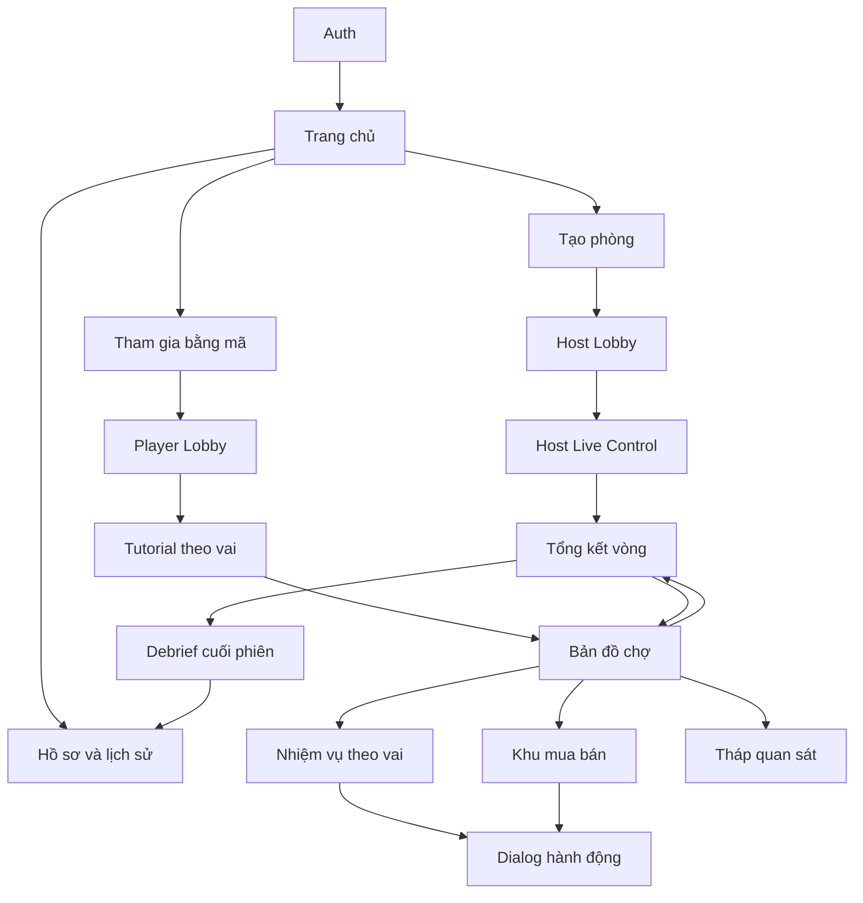
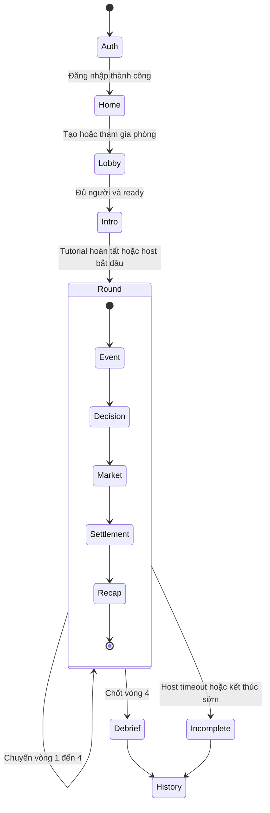
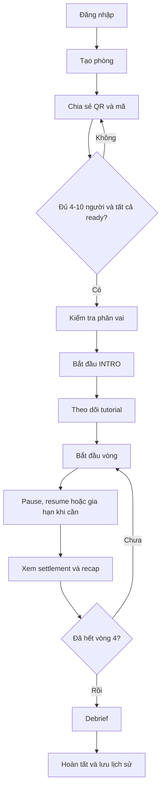
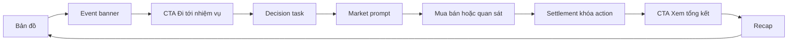
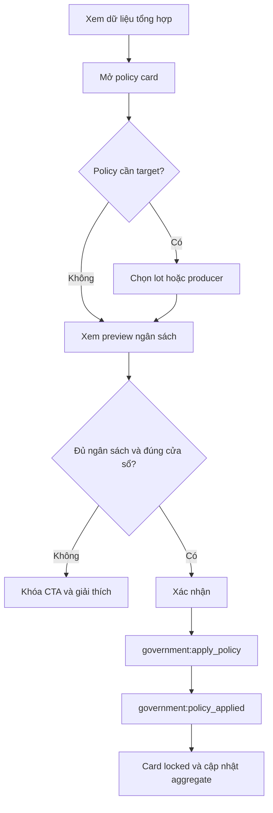
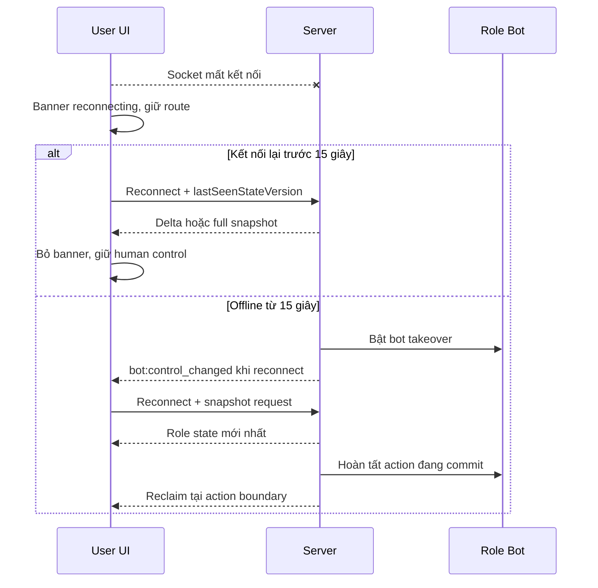
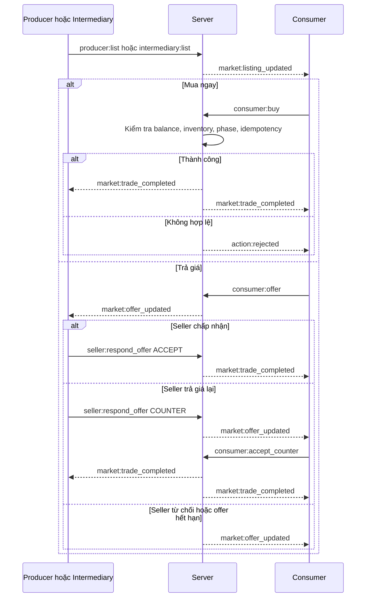
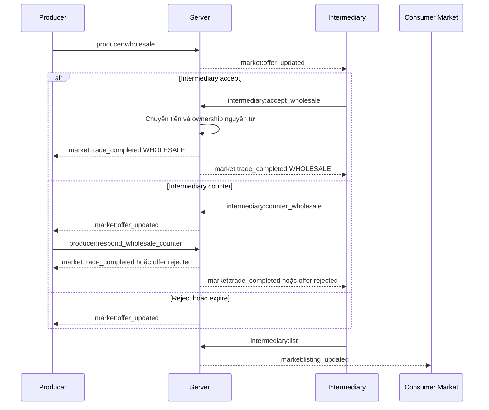

# USER INTERACTION DOCUMENT (UID)

## PHIÊN CHỢ GIÁ TRỊ ONLINE

**Tài liệu luồng tương tác người dùng cho web app trải nghiệm đa người chơi thời gian thực**

---

## 0. Quản lý tài liệu

| Thuộc tính         | Giá trị                                                                             |
| ------------------ | ----------------------------------------------------------------------------------- |
| Mã dự án           | SPST-C2-02                                                                          |
| Tên chủ đề         | Phiên chợ giá trị                                                                   |
| Phiên bản UID      | 1.0.0                                                                               |
| Ngày cập nhật      | 24/06/2026                                                                          |
| Trạng thái         | Baseline - sẵn sàng cho wireflow/prototype                                          |
| Tài liệu nguồn     | `SRS MLN122.md`, phiên bản 1.0.0                                                    |
| Ngôn ngữ giao diện | Tiếng Việt                                                                          |
| Tiền tệ            | Đồng Việt Nam, hiển thị theo nghìn Đồng                                             |
| Đầu ra             | Một tài liệu Markdown gồm user flow, interaction matrix, ASCII wireframe và Mermaid |

### 0.1 Mục đích

UID mô tả cách người dùng đi qua hệ thống, nhìn thấy thông tin gì, được phép làm gì, nhận phản hồi nào và phục hồi ra sao khi có lỗi hoặc thay đổi realtime. UID là cầu nối giữa yêu cầu trong SRS và công việc thiết kế wireflow/prototype/frontend.

UID không thay thế SRS. Khi có xung đột:

1. Luật kinh tế, tiền, quyền role, phase, API và business rule trong SRS được ưu tiên.
2. UID được ưu tiên cho thứ tự tương tác, điều hướng, focus, feedback và microcopy.
3. Mọi thay đổi phát sinh từ UID phải được ghi trong Mục 14 - SRS Delta Register trước khi triển khai backend.

### 0.2 Đối tượng sử dụng

- UI/UX designer dựng wireflow và prototype.
- Frontend developer triển khai navigation, state và feedback.
- Backend/realtime developer đối chiếu command/event với hành động UI.
- QA/QC xây test theo user journey.
- Host/người thuyết trình hiểu cách vận hành phiên.
- Người kiểm duyệt nội dung lý thuyết đối chiếu `LT-*`.

### 0.3 Phạm vi UID

UID bao phủ toàn bộ end-to-end flow:

- Google Sign-In, email/password, xác minh và reset password.
- Trang chủ, hồ sơ và lịch sử.
- Tạo, tham gia và vận hành phòng.
- Tutorial ba bước theo vai.
- Bản đồ chợ, dashboard bốn vai và tháp quan sát.
- Sản xuất, mua ngay, offer, counter, bán sỉ và chính sách.
- Phase transition, settlement và recap.
- Reconnect, bot takeover, duplicate tab và stale state.
- Debrief, badge và session `INCOMPLETE`.

UID không khóa:

- Màu sắc thương hiệu.
- Typography, icon set hoặc spacing token cuối cùng.
- Pixel-perfect layout.
- Animation trang trí không mang ý nghĩa trạng thái.
- HTML prototype hoặc design system component API.

### 0.4 Quy ước định danh

| Tiền tố | Ý nghĩa                                   | Ví dụ                |
| ------- | ----------------------------------------- | -------------------- |
| `UF`    | User flow end-to-end hoặc theo nhiệm vụ   | `UF-CONSUMER-02`     |
| `IX`    | Interaction có trigger và phản hồi cụ thể | `IX-CONSUMER-BUY`    |
| `WF`    | ASCII wireframe                           | `WF-05`              |
| `NAV`   | Quy tắc điều hướng                        | `NAV-04`             |
| `COPY`  | Microcopy đã khóa                         | `COPY-PHASE-02`      |
| `STATE` | Trạng thái UI dùng chung                  | `STATE-RECONNECTING` |
| `DELTA` | Bổ sung cần đồng bộ ngược về SRS          | `DELTA-SRS-01`       |
| `UITC`  | User interaction test case                | `UITC-CONSUMER-01`   |

### 0.5 Thuật ngữ UI bắt buộc

| Thuật ngữ           | Cách dùng                                                                      |
| ------------------- | ------------------------------------------------------------------------------ |
| Chợ                 | Bản đồ 2D và các khu chức năng; không đồng nghĩa toàn bộ khái niệm thị trường. |
| Nhiệm vụ            | Dashboard hành động riêng theo role và phase.                                  |
| Quan sát            | Tháp quan sát cung-cầu, giá trị và giá thị trường.                             |
| Giá trị             | Giá trị xã hội của hàng hóa theo TGLĐXHCT.                                     |
| Giá niêm yết        | Giá người bán công bố, chưa phải giá thị trường.                               |
| Giá giao dịch       | Giá hai bên thực sự thanh toán.                                                |
| Giá thị trường      | Giá bình quân gia quyền của giao dịch bán lẻ hoàn tất trong vòng.              |
| Số dư               | Số Đồng người chơi đang có; UI chính hiển thị theo nghìn Đồng.                 |
| Offer/Trả giá       | Đề nghị giá chưa hoàn tất giao dịch. Trên UI ưu tiên từ “Trả giá”.             |
| Counter/Trả giá lại | Giá phản hồi từ phía còn lại. Trên UI ưu tiên từ “Trả giá lại”.                |
| Host                | Người điều phối phiên, không phải Nhà nước.                                    |

---

## 1. Nguyên tắc tương tác

### 1.1 Nguồn sự thật

- Server quyết định role, phase, timer, tiền, inventory, transaction, policy, score và result.
- Client được phép optimistic feedback ở mức loading/disabled, không tự cộng tiền/hàng trước event thành công.
- Mọi action gửi server có `clientActionId`; retry không tạo mutation mới.
- Khi `stateVersion` cũ, UI ngừng action, lấy state mới và giải thích thay đổi cho người dùng.

### 1.2 Bản đồ làm hub

Người chơi luôn có thể quay về bản đồ chợ. Bản đồ là điểm định hướng không gian, còn thao tác chi tiết diễn ra ở route/panel chuyên biệt.

Mobile navigation cố định gồm:

1. **Chợ** - bản đồ 2D, tab mặc định.
2. **Nhiệm vụ** - dashboard theo role.
3. **Quan sát** - cung, cầu, giá trị và giao dịch.

Host dùng shell desktop riêng, không dùng mobile bottom navigation.

### 1.3 Không tự chuyển route người chơi

Khi phase đổi, hệ thống:

- Giữ nguyên route và vị trí đọc hiện tại.
- Đóng hoặc khóa action thuộc phase cũ.
- Hiển thị phase banner cố định.
- Hiển thị CTA **“Đi tới nhiệm vụ”** trỏ tới màn hình phù hợp.
- Không giật focus.

Ngoại lệ không phải điều hướng:

- `SETTLEMENT` hiển thị blocking status layer trên route hiện tại vì mọi mutation bị khóa.
- Session `COMPLETED`, `INCOMPLETE` hoặc `CANCELLED` hiển thị session-ended layer và CTA tới debrief/history.
- Host/projector tự thay nội dung công khai theo phase để phục vụ trình chiếu.

### 1.4 Progressive disclosure

- Màn hình mặc định chỉ hiện dữ liệu cần ra quyết định ở phase hiện tại.
- Công thức và lý thuyết đầy đủ nằm trong tooltip/drawer “Vì sao?”.
- Action không hợp lệ bị disabled kèm lý do, không bị ẩn nếu người dùng cần hiểu quy trình.
- Dữ liệu riêng như individual cost, balance và pending strategy chỉ hiện cho đúng owner.

### 1.5 Phản hồi action

Mọi mutation tuân theo chu kỳ:

```text
Idle → Confirm nếu có hậu quả tiền/hàng
→ Pending: khóa action và hiện tiến trình
→ Success: cập nhật từ server event + thông báo
hoặc
→ Failure: mở lại action + lỗi cụ thể + state mới nếu stale
```

Không dùng toast thành công để thay cho thay đổi trạng thái chính. Toast chỉ xác nhận; wallet, inventory, listing hoặc policy card phải cập nhật trực tiếp.

---

## 2. Tác nhân và thiết bị

| Tác nhân                  | Thiết bị ưu tiên              | Mục tiêu tương tác                                    | Shell                               |
| ------------------------- | ----------------------------- | ----------------------------------------------------- | ----------------------------------- |
| Người dùng chưa đăng nhập | Mobile/desktop                | Đăng nhập hoặc tạo tài khoản.                         | Auth shell                          |
| Player                    | Mobile portrait từ 360px      | Hoàn thành nhiệm vụ theo role, giao dịch và quan sát. | Player shell: Chợ/Nhiệm vụ/Quan sát |
| Host                      | Desktop/projector từ 1280x720 | Tạo phòng, điều phối timer/phase và trình chiếu.      | Host control shell                  |
| Producer                  | Mobile                        | Sản xuất, bán trực tiếp/sỉ, phản hồi offer, đầu tư.   | Player shell + producer task        |
| Consumer                  | Mobile                        | Xem need, so sánh listing, mua/trả giá.               | Player shell + market task          |
| Intermediary              | Mobile/tablet                 | Mua sỉ, quản lý kho, bán lẻ.                          | Player shell + distribution task    |
| Government                | Mobile/tablet                 | Xem aggregate, chọn policy và theo dõi social score.  | Player shell + policy task          |

---

## 3. Kiến trúc thông tin và điều hướng

~

### 3.1 Sitemap



### 3.2 Routes khái niệm

Routes là tên logic; framework có thể thay đổi cấu trúc URL nhưng phải giữ hành vi.

| Route logic                 | UI nguồn                         | Quyền                 | Back destination                      |
| --------------------------- | -------------------------------- | --------------------- | ------------------------------------- |
| `/auth`                     | `UI-AUTH-01`                     | Public                | Không có                              |
| `/home`                     | `UI-HOME-01`                     | Authenticated         | Auth sau logout                       |
| `/profile`                  | `UI-PROFILE-01`                  | Authenticated         | Home                                  |
| `/history/:sessionId`       | `UI-DEBRIEF-01`, `UI-PROFILE-01` | Member/host           | Profile                               |
| `/session/:id/lobby`        | `UI-LOBBY-01`                    | Member/host           | Home với confirm leave                |
| `/session/:id/tutorial`     | Tutorial extension               | Player                | Lobby hoặc map sau hoàn tất           |
| `/session/:id/map`          | `UI-MAP-01`                      | Member/host read-only | Không thoát session bằng browser back |
| `/session/:id/task`         | Role dashboard                   | Player                | Map                                   |
| `/session/:id/market`       | `UI-CONSUMER-01`, `UI-TRADE-01`  | Player theo quyền     | Map                                   |
| `/session/:id/observatory`  | `UI-OBSERVATORY-01`              | Member/host           | Map                                   |
| `/session/:id/recap/:round` | `UI-RECAP-01`                    | Member/host           | Map/next round                        |
| `/session/:id/debrief`      | `UI-DEBRIEF-01`                  | Member/host           | Home/history                          |
| `/host/session/:id`         | `UI-HOST-01`                     | Host                  | Home với confirm end/cancel           |

### 3.3 Navigation rules

| ID       | Quy tắc                                                                                                                                                                                            |
| -------- | -------------------------------------------------------------------------------------------------------------------------------------------------------------------------------------------------- |
| `NAV-01` | Sau auth thành công, về Home; nếu có pending join code hợp lệ thì tiếp tục join sau khi xác thực.                                                                                                  |
| `NAV-02` | Player shell mặc định mở tab Chợ; reload giữ route hiện tại nếu route còn hợp lệ trong phase.                                                                                                      |
| `NAV-03` | Mọi dashboard role có “Về bản đồ”; mobile hardware/browser back đóng sheet/dialog trước, sau đó về map.                                                                                            |
| `NAV-04` | Browser back từ map trong active session không rời phiên; mở confirm “Bạn muốn rời màn hình phiên chợ?”. Sau `INTRO`, không có action rời ghế, chỉ về Home ở chế độ phiên vẫn hoạt động/reconnect. |
| `NAV-05` | Phase đổi không tự đổi route player; banner và CTA đưa tới route phù hợp.                                                                                                                          |
| `NAV-06` | Route không hợp lệ với role trả về map và hiện `ROLE_FORBIDDEN`, không để blank/403 page.                                                                                                          |
| `NAV-07` | Route action không hợp lệ với phase vẫn hiển thị nội dung read-only và lý do khóa.                                                                                                                 |
| `NAV-08` | Session kết thúc đưa CTA tới debrief; không tự đẩy player khỏi nội dung đang đọc cho tới khi họ chọn CTA.                                                                                          |
| `NAV-09` | Host/projector tự cập nhật view theo phase nhưng host controls luôn cố định.                                                                                                                       |
| `NAV-10` | Deep link vào session yêu cầu auth; sau auth phải quay lại đúng deep link nếu user là member.                                                                                                      |

### 3.4 Ma trận phase và CTA

| Phase         | Player giữ route? | Mutation                            | Banner                       | CTA “Đi tới nhiệm vụ”                                       | Host/projector                                     |
| ------------- | ----------------- | ----------------------------------- | ---------------------------- | ----------------------------------------------------------- | -------------------------------------------------- |
| `EVENT`       | Có                | Khóa                                | Tên vòng + biến cố + 15 giây | Xem event detail/map                                        | Tự hiện event card                                 |
| `DECISION`    | Có                | Chỉ action quyết định/policy hợp lệ | “Đã tới lúc ra quyết định”   | Producer/State tới task; Consumer/Intermediary xem chuẩn bị | Tự hiện roster progress + aggregate không riêng tư |
| `MARKET_OPEN` | Có                | Giao dịch hợp lệ                    | “Chợ đã mở”                  | Tới market hoặc role trade task                             | Tự hiện market + observatory                       |
| `SETTLEMENT`  | Có                | Khóa toàn bộ                        | “Đang chốt sổ”               | Không có                                                    | Tự hiện settlement animation/status                |
| `RECAP`       | Có                | Khóa gameplay                       | “Vòng đã kết thúc”           | Xem tổng kết                                                | Tự hiện recap                                      |
| `PAUSED`      | Có                | Khóa                                | “Host đã tạm dừng phiên”     | Không có                                                    | Hiện resume control                                |

---

## 4. User flows tổng thể

### 4.1 Session lifecycle



### 4.2 Host journey



### 4.3 Player phase loop



### 4.4 Bốn role journey

```mermaid
flowchart TD
    subgraph P["Người sản xuất"]
      P1["Xem lao động và chi phí"] --> P2["Chọn sản lượng"] --> P3["Bán trực tiếp hoặc bán sỉ"] --> P4["Phản hồi offer"] --> P5["Xem lợi nhuận và tồn"]
    end
    subgraph C["Người tiêu dùng"]
      C1["Xem need và ngân sách"] --> C2["So sánh listing"] --> C3["Mua ngay hoặc trả giá"] --> C4["Nhận phản hồi"] --> C5["Xem utility"]
    end
    subgraph I["Trung gian"]
      I1["Xem wholesale inbox"] --> I2["Mua sỉ"] --> I3["Quản lý kho"] --> I4["Niêm yết bán lẻ"] --> I5["Xem lợi nhuận"]
    end
    subgraph S["Nhà nước"]
      S1["Xem dữ liệu tổng hợp"] --> S2["So sánh policy"] --> S3["Chọn mục tiêu"] --> S4["Xác nhận chi phí"] --> S5["Xem social score"]
    end
```



---

## 5. User flow chi tiết

Mỗi flow dưới đây dùng cấu trúc: **Entry → Preconditions → Happy path → Alternative/Error → Exit → Traceability**.

### 5.1 Tài khoản

#### `UF-AUTH-01` - Google Sign-In

- **Entry:** `UI-AUTH-01`, CTA “Tiếp tục với Google”.
- **Preconditions:** Chưa đăng nhập; trình duyệt cho phép OAuth redirect/popup.
- **Happy path:** Bấm CTA → pending state → Google consent → callback thành công → lấy/tạo user theo verified email → về Home hoặc pending deep link.
- **Alternative:** User cancel → trở lại Auth, không hiện lỗi đỏ; provider unavailable → lỗi có CTA thử lại; verified email trùng email identity → liên kết cùng user.
- **Exit:** `UI-HOME-01` hoặc session deep link.
- **Traceability:** `FR-AUTH-01`, `FR-AUTH-05`, `UI-AUTH-01`.

#### `UF-AUTH-02` - Đăng ký email và xác minh

- **Entry:** Auth → “Đăng ký bằng email”.
- **Preconditions:** Email chưa có identity.
- **Happy path:** Nhập display name/email/password → kiểm tra inline → gửi → màn hình “Kiểm tra email” → mở verification link → trạng thái verified → CTA “Vào phiên chợ”.
- **Alternative:** Email đã dùng → CTA đăng nhập/reset; password yếu → chỉ rõ yêu cầu; link hết hạn → “Gửi lại email xác minh”.
- **Exit:** Home.
- **Traceability:** `FR-AUTH-02`, `UI-AUTH-01`.

#### `UF-AUTH-03` - Đăng nhập email và reset password

- **Entry:** Auth form hoặc “Quên mật khẩu”.
- **Happy path login:** Nhập email/password → pending → Home.
- **Happy path reset:** Nhập email → luôn hiện thông báo trung tính → mở token → nhập password mới → thành công → CTA đăng nhập.
- **Alternative:** Sai credentials không tiết lộ email tồn tại; email chưa verify có CTA gửi lại; token hết hạn/đã dùng có CTA yêu cầu link mới.
- **Exit:** Home/Auth.
- **Traceability:** `FR-AUTH-03`, `FR-AUTH-04`, `UI-AUTH-01`.

### 5.2 Home, tạo và tham gia phòng

#### `UF-HOME-01` - Host tạo phòng

- **Entry:** `UI-HOME-01`, CTA “Tạo phòng”.
- **Preconditions:** Authenticated; không host một active session khác.
- **Happy path:** Bấm CTA → loading → server tạo `dragon-fruit-v1` → vào Host Lobby → hiện QR, code, roster 0/10.
- **Alternative:** Có active host session → CTA “Quay lại phòng đang mở”; lỗi mạng → retry với cùng request intent.
- **Exit:** `UI-LOBBY-01` host variant.
- **Traceability:** `FR-ROOM-01`, `UI-HOME-01`, `UI-LOBBY-01`.

#### `UF-HOME-02` - Player tham gia phòng

- **Entry:** Nhập code hoặc QR deep link.
- **Preconditions:** Authenticated; room ở lobby; còn ghế.
- **Happy path:** Nhập 6 ký tự → normalize uppercase → CTA “Tham gia phiên chợ” → join → Player Lobby.
- **Alternative:** Sai code, hết hạn, đủ 10, session đã bắt đầu; mỗi lỗi có CTA phù hợp, không xóa code trừ khi user sửa.
- **Exit:** Player Lobby.
- **Traceability:** `FR-ROOM-02`, `FR-ROOM-08`, `UI-HOME-01`.

### 5.3 Lobby, phân vai và tutorial

#### `UF-PLAYER-01` - Ready và nhận vai

- **Entry:** Player Lobby sau join.
- **Preconditions:** Session `LOBBY`.
- **Happy path:** Xem roster/count → CTA “Tôi đã sẵn sàng” → trạng thái ready → nhận role preview khi assignment cập nhật → host start → role locked.
- **Alternative:** Toggle bỏ ready; mất mạng 15 giây chuyển not-ready; host đổi role cập nhật role card và announcement.
- **Exit:** Tutorial/Intro.
- **Traceability:** `FR-ROOM-03`, `FR-ROOM-04`, `FR-ROOM-05`, `UI-LOBBY-01`.

#### `UF-HOST-01` - Start guard

- **Entry:** Host Lobby.
- **Preconditions:** 4-10 human, tất cả ready.
- **Happy path:** Host xem role distribution → CTA “Bắt đầu” enabled → confirm ngắn “Khóa danh sách và bắt đầu?” → `host:start` → INTRO.
- **Alternative:** Chưa đủ/ready=false → CTA disabled, dòng lý do; roster thay đổi trong confirm → server reject và refresh guard.
- **Exit:** Host Intro view.
- **Traceability:** `FR-HOST-01`, `BR-ROLE-01`, `UI-HOST-01`.

#### `UF-TUTORIAL-01` - Tutorial ba bước theo vai

- **Entry:** INTRO sau role assignment hoặc menu “Xem lại hướng dẫn”.
- **Preconditions:** Có role; scenario version đã biết.
- **Lần đầu:** Không có nút bỏ qua; Next chỉ bật sau khi nội dung bước hiện đầy đủ; bước 3 gửi `participant:tutorial_completed`.
- **Lần sau:** Có “Bỏ qua” và “Xem lại”; bỏ qua không xóa progress.
- **Host:** Chỉ thấy participant `Chưa bắt đầu / Đang xem / Hoàn tất`; không thấy step content riêng.
- **Guard bắt buộc:** Host không thể chuyển từ `INTRO` sang vòng 1 khi còn first-time participant chưa `COMPLETED`. Người đã có progress được tính hoàn tất ngay cả khi chọn “Bỏ qua”. Không có timeout bypass.
- **Exit:** Map sau khi hoàn tất; host được mở vòng 1 khi mọi participant đã đáp ứng tutorial guard.
- **Traceability:** `DELTA-SRS-01`, `UI-MAP-01`, `LT-13`.

Nội dung ba bước:

| Role         | Bước 1 - Mục tiêu                                    | Bước 2 - Hành động chính                               | Bước 3 - Cần quan sát                                |
| ------------ | ---------------------------------------------------- | ------------------------------------------------------ | ---------------------------------------------------- |
| Producer     | Bán hàng để thực hiện giá trị và quản lý chi phí.    | Sản xuất; bán trực tiếp/sỉ; đầu tư/phản hồi offer.     | Hao phí cá biệt so với TGLĐXHCT; tồn kho; lợi nhuận. |
| Consumer     | Đáp ứng nhu cầu với ngân sách hợp lý.                | So sánh; mua ngay/trả giá; phản hồi counter.           | Need; cung-cầu; giá niêm yết và giá giao dịch.       |
| Intermediary | Kết nối sản xuất-tiêu dùng và chịu rủi ro lưu thông. | Mua sỉ; niêm yết bán lẻ; phản hồi offer.               | Biên lợi nhuận; hàng tồn; số bên được kết nối.       |
| Government   | Cải thiện kết quả xã hội bằng ngân sách hữu hạn.     | Đọc aggregate; chọn policy/mục tiêu; xác nhận chi phí. | Cung-cầu; lãng phí; fulfillment; social score.       |

### 5.4 Host live flow

#### `UF-HOST-02` - Điều phối bốn vòng

- **Entry:** Host Live Control.
- **Happy path:** Xem event → phase timer → pause/resume/extend nếu cần → settlement tự chạy → recap tối thiểu 30 giây → “Vòng tiếp theo” → sau vòng 4 mở debrief.
- **Guards:** Extend tối đa hai lần/phase; không next khi chưa đủ điều kiện; không skip vòng.
- **Feedback:** Control pending cho tới `session:state`/`round:phase_changed`; projector content tự đổi nhưng control rail giữ nguyên.
- **Exit:** Debrief/completed.
- **Traceability:** `FR-HOST-02` đến `FR-HOST-05`, `FR-GAME-01`, `UI-HOST-01`.

#### `UF-HOST-03` - Host disconnect/incomplete

- **Entry:** Host socket offline.
- **Flow:** 0-15 giây hiện reconnecting cục bộ → 15 giây server auto-pause, toàn phòng nhận banner → host có 120 giây reconnect → thành công thì CTA “Tiếp tục phiên” → timeout thì `INCOMPLETE`.
- **Exit:** Active session hoặc incomplete history.
- **Traceability:** `FR-HOST-06`, `STATE-RECONNECTING`, `STATE-INCOMPLETE`.

### 5.5 Người sản xuất

#### `UF-PRODUCER-01` - Chọn sản lượng

- **Entry:** Phase `DECISION`, CTA “Đi tới nhiệm vụ”.
- **Preconditions:** Producer human control; không paused/bot takeover.
- **Happy path:** Xem labor/value card → tăng/giảm quantity trong allowed range → UI cập nhật tổng chi phí dự kiến → CTA “Sản xuất” → confirm tiền/hàng → pending → wallet/inventory cập nhật.
- **Alternative:** Quantity 0 cho phép “Không sản xuất vòng này”; vượt cap/thiếu vốn disabled kèm lý do; có thể sửa/hủy trước khi listing/wholesale và trước market.
- **Exit:** Producer dashboard với inventory mới.
- **Traceability:** `FR-PRODUCER-01` đến `FR-PRODUCER-03`, `BR-VALUE-*`, `LT-03`, `LT-04`.

#### `UF-PRODUCER-02` - Bán trực tiếp

- **Entry:** Inventory available, `MARKET_OPEN`.
- **Happy path:** “Đưa ra chợ” → chọn lot/quantity/giá → preview `x nghìn Đồng` → confirm → listing card xuất hiện → nhận offer → accept/reject/counter → transaction success.
- **Alternative:** Đóng listing trả inventory; sold-out/stale khi accept → refresh và thông báo; offer hết hạn → read-only history.
- **Exit:** Listing/inventory/profit state.
- **Traceability:** `FR-PRODUCER-04`, `FR-PRODUCER-08`, `FR-MARKET-02` đến `FR-MARKET-05`, `LT-07`, `LT-12`.

#### `UF-PRODUCER-03` - Bán sỉ

- **Entry:** Inventory available, market open, intermediary tồn tại.
- **Happy path:** “Bán sỉ” → quantity/minimum price → gửi → trạng thái “Đang chờ trung gian” → accept hoặc counter → producer chấp nhận counter → tiền và ownership chuyển ngay.
- **Alternative:** Reject/expire/cancel; intermediary thiếu tiền; inventory thay đổi làm offer stale.
- **Exit:** Wholesale transaction hoặc inventory available.
- **Traceability:** `FR-PRODUCER-05`, `FR-INTERMEDIARY-02`, `BR-TRADE-01`, `LT-13`.

#### `UF-PRODUCER-04` - Đầu tư công nghệ

- **Entry:** `DECISION` vòng 1-3, chưa Pioneer.
- **Happy path:** Mở upgrade card → xem chi phí hiện tại/sau nâng cấp và thời điểm hiệu lực → confirm → pending upgrade badge → áp dụng vòng sau.
- **Alternative:** Thiếu tiền, vòng 4, upgrade trùng; có hỗ trợ Nhà nước thì giá gốc và mức giảm hiển thị riêng.
- **Exit:** Producer task.
- **Traceability:** `FR-PRODUCER-07`, `BR-VALUE-04`, `LT-05`, `LT-10`.

### 5.6 Người tiêu dùng

#### `UF-CONSUMER-01` - Duyệt và mua ngay

- **Entry:** Market zone hoặc CTA “Đi tới khu mua hàng”.
- **Happy path:** Xem need/balance → sort listing → mở listing → chọn quantity → “Mua ngay” → confirm total → pending → trade completed → need, wallet và inventory nhận cập nhật.
- **Alternative:** Sold-out concurrent, thiếu tiền, phase đóng; stale tự refresh và giữ user ở marketplace.
- **Exit:** Marketplace hoặc map.
- **Traceability:** `FR-CONSUMER-01` đến `FR-CONSUMER-03`, `FR-MARKET-04`, `LT-02`, `LT-11`.

#### `UF-CONSUMER-02` - Trả giá và counter

- **Entry:** Listing detail → “Trả giá”.
- **Happy path:** Chọn quantity/offer price → xem tiền reservation → gửi → status “Đang chờ phản hồi” → seller accept hoặc counter → consumer chấp nhận → transaction.
- **Alternative:** Seller reject, offer expire, consumer hủy trước seller response nếu server rule cho phép đóng offer; counter vượt balance/phase close → không thể accept.
- **Exit:** Offer inbox/marketplace.
- **Traceability:** `FR-CONSUMER-04`, `FR-PRODUCER-08`, `FR-INTERMEDIARY-04`, `BR-TRADE-04`, `LT-07`, `LT-12`.

### 5.7 Trung gian

#### `UF-INTERMEDIARY-01` - Mua sỉ

- **Entry:** Wholesale inbox trong market.
- **Happy path:** Mở offer → xem quantity/minimum/total và vốn sau mua → accept hoặc counter → nếu producer accept, wallet giảm và inventory tăng.
- **Alternative:** Không đủ vốn, inventory producer stale, offer expired/rejected.
- **Exit:** Owned inventory.
- **Traceability:** `FR-INTERMEDIARY-01`, `FR-INTERMEDIARY-02`, `LT-13`.

#### `UF-INTERMEDIARY-02` - Bán lẻ

- **Entry:** Owned inventory.
- **Happy path:** “Niêm yết bán lẻ” → quantity/ask → listing → nhận consumer offer → accept/reject/counter → completed → profit cập nhật.
- **Alternative:** Đóng listing, hàng tồn/hỏng, kho lạnh bảo vệ.
- **Exit:** Intermediary dashboard/recap.
- **Traceability:** `FR-INTERMEDIARY-03` đến `FR-INTERMEDIARY-05`, `LT-13`, `LT-14`.

### 5.8 Nhà nước

#### `UF-STATE-01` - Chọn và áp dụng policy

- **Entry:** Government task trong cửa sổ policy hợp lệ.
- **Happy path:** Xem aggregate → mở policy card → xem tác dụng/chi phí/cửa sổ → chọn target nếu cần → preview budget before/after → confirm “Áp dụng chính sách” → event public → policy card locked.
- **Không can thiệp:** Chọn card riêng, confirm, chi phí 0, vẫn đóng slot.
- **Alternative:** Thiếu ngân sách, target invalid, quá cửa sổ, policy đã dùng; action disabled kèm lý do.
- **Exit:** Government dashboard/observatory.
- **Traceability:** `FR-STATE-01` đến `FR-STATE-06`, `BR-STATE-*`, `LT-08`, `LT-13`, `LT-14`.



### 5.9 Quan sát, recap và debrief

#### `UF-OBSERVATORY-01` - Quan sát giá trị và thị trường

- **Entry:** Tab Quan sát, map tower hoặc host projector.
- **Happy path:** Xem current supply/demand → value line → retail transaction/market price → mở “Vì sao?” để đọc giải thích.
- **No-price:** Nếu chưa có completed retail transaction, khu giá thị trường ghi “Chưa hình thành”; chart không nối điểm giả.
- **Round 4:** Animation TGLĐXHCT 2→1, value 10→6 nghìn Đồng, có reduced-motion alternative dạng text.
- **Traceability:** `FR-ANALYTICS-01` đến `FR-ANALYTICS-03`, `UI-OBSERVATORY-01` đến `UI-OBSERVATORY-03`, `LT-09`, `LT-11`.

#### `UF-RECAP-01` - Tổng kết vòng

- **Entry:** Phase `RECAP`, CTA “Xem tổng kết”.
- **Happy path:** Xem actual vs expected → role-specific outcome → hàng tồn/hỏng → theory card → CTA “Về bản đồ”; host có “Vòng tiếp theo” sau 30 giây.
- **Alternative:** Không có market price; actual ngược xu hướng; no action/no investment đều hiển thị trung thực.
- **Traceability:** `FR-ANALYTICS-04` đến `FR-ANALYTICS-06`, `UI-RECAP-01` đến `UI-RECAP-04`, `LT-09` đến `LT-14`.

#### `UF-DEBRIEF-01` - Debrief cuối phiên

- **Entry:** Sau vòng 4 hoặc session-ended CTA.
- **Happy path:** Xem chart bốn vòng → own role result → public role summary → ba tác động → four-actor recap → badge → “Về trang chủ”/“Xem trong lịch sử”.
- **Incomplete:** Không badge; banner lý do phiên chưa hoàn tất; chỉ hiển thị vòng đã chốt.
- **Traceability:** `FR-ANALYTICS-05` đến `FR-HISTORY-03`, `UI-DEBRIEF-01`.

### 5.10 Hồ sơ và lịch sử

#### `UF-PROFILE-01` - Hồ sơ và lịch sử

- **Entry:** Home avatar/menu.
- **Happy path:** Sửa display name/avatar → lưu → mở history card → xem own result và public market chart.
- **Empty:** CTA “Tham gia phiên chợ đầu tiên”.
- **Traceability:** `FR-PROFILE-01`, `FR-PROFILE-02`, `FR-HISTORY-02`, `FR-HISTORY-03`, `UI-PROFILE-01`.

#### `UF-PROFILE-02` - Xóa tài khoản

- **Entry:** Profile settings.
- **Flow:** “Xóa tài khoản” → cảnh báo dữ liệu → re-auth → nhập/xác nhận phrase → submit → logout.
- **Alternative:** Active host session → blocked với CTA quay lại/kết thúc session; network failure không logout/xóa local trước server acceptance.
- **Traceability:** `FR-PROFILE-03`, `UI-PROFILE-01`.

### 5.11 Realtime và phục hồi

#### `UF-RECOVERY-01` - Reconnect và bot takeover



- Offline chưa đủ 15 giây: giữ controls visible nhưng disabled/pending network.
- Bot takeover: persistent banner “Bot đang tạm điều khiển vai của bạn”; màn hình read-only.
- Reclaim: focus vào banner thành công, sau đó trở lại control trước đó nếu còn hợp lệ.
- Traceability: `FR-GAME-03`, `FR-ROOM-07`, `NFR-REC-01`, `NFR-REC-02`.

#### `UF-RECOVERY-02` - Duplicate tab, stale state và phase changed

- Tab mới nhất có control; tab cũ nhận `READ_ONLY_DUPLICATE_TAB` và CTA “Điều khiển ở tab này” nếu cơ chế server cho takeover.
- `STALE_STATE`: giữ route, đóng pending state, refresh delta/snapshot, đánh dấu phần dữ liệu vừa đổi trong thời gian ngắn.
- Phase changed khi dialog mở: dialog đóng, draft không gửi bị hủy, banner phase mới và CTA xuất hiện.
- Action retry dùng cùng `clientActionId`; UI không tạo toast success lần hai.
- Traceability: `FR-MARKET-05`, `FR-MARKET-07`, `NAV-05`.

---

## 6. Giao dịch và realtime sequence

### 6.1 Direct retail



### 6.2 Wholesale



---

## 7. Screen specification

### 7.1 Ma trận màn hình

| UI                   | Entry                 | Actor/Phase               | Primary action          | Secondary action      | Exit/Back                | State bắt buộc                               | Traceability                               |
| -------------------- | --------------------- | ------------------------- | ----------------------- | --------------------- | ------------------------ | -------------------------------------------- | ------------------------------------------ |
| `UI-AUTH-01`         | Public/deep link      | Guest                     | Google hoặc email login | Register/reset        | Home/deep link           | Loading, invalid, unverified, conflict       | `FR-AUTH-01` đến `06`                      |
| `UI-HOME-01`         | Sau auth              | User                      | Tạo phòng/Tham gia      | History/profile       | Auth sau logout          | Empty history, invalid code, active session  | `FR-ROOM-01`, `02`, `FR-PROFILE-02`        |
| `UI-LOBBY-01`        | Create/join           | Host/Player, Lobby        | Ready hoặc Start        | Share QR/role preview | Home với confirm         | Under-min, full, disconnect, all-ready       | `FR-ROOM-*`, `FR-HOST-01`                  |
| `UI-HOST-01`         | Host session          | Host, active              | Pause/resume/next       | Extend/end            | Home với confirm         | Paused, reconnecting, settlement, incomplete | `FR-HOST-*`                                |
| `UI-MAP-01`          | Tutorial/player shell | Member, active            | Mở khu/Đi tới nhiệm vụ  | Quan sát              | Không rời active session | Phase lock, offline, bot, ended              | `FR-GAME-*`, `LT-07`, `LT-13`              |
| `UI-PRODUCER-01`     | Nhiệm vụ/Nông trại    | Producer                  | Sản xuất/list/wholesale | Upgrade               | Map                      | Cap, funds, phase lock, bot                  | `FR-PRODUCER-*`                            |
| `UI-CONSUMER-01`     | Market zone           | Consumer                  | Mua ngay/Trả giá        | Sort/filter           | Map                      | Empty, sold-out, insufficient, offer-open    | `FR-CONSUMER-*`                            |
| `UI-INTERMEDIARY-01` | Distribution zone     | Intermediary              | Mua sỉ/Niêm yết         | Counter               | Map                      | Empty inbox, funds, stock, spoilage          | `FR-INTERMEDIARY-*`                        |
| `UI-STATE-01`        | Government zone       | Government                | Áp dụng policy          | Không can thiệp       | Map/Observe              | Window lock, budget, policy-used, bot        | `FR-STATE-*`                               |
| `UI-TRADE-01`        | Listing/offer card    | Buyer/Seller, Market      | Confirm action          | Cancel/counter        | Trigger screen           | Pending, stale, expired, success, failure    | `FR-MARKET-*`                              |
| `UI-OBSERVATORY-01`  | Tab/Tower             | Member, all active phases | Xem giải thích          | Chọn vòng/metric      | Map                      | No-price, delayed, round transition          | `FR-ANALYTICS-01` đến `03`                 |
| `UI-RECAP-01`        | Recap CTA             | Member, Recap             | Xem outcome             | Về bản đồ             | Map/next                 | No-price, aligned, not-aligned               | `FR-ANALYTICS-04` đến `06`                 |
| `UI-DEBRIEF-01`      | End session/history   | Member/Host               | Xem history             | Về Home               | Home/Profile             | Completed, incomplete, no badge              | `FR-ANALYTICS-05` đến `07`, `FR-HISTORY-*` |
| `UI-PROFILE-01`      | Home menu             | User                      | Sửa profile/Mở history  | Xóa account           | Home                     | Empty, loading, deletion pending             | `FR-PROFILE-*`, `FR-HISTORY-*`             |

### 7.2 State behavior theo màn hình

| State           | Màn hình áp dụng                  | Hành vi                                                                                             |
| --------------- | --------------------------------- | --------------------------------------------------------------------------------------------------- |
| Loading         | Tất cả data screen                | Skeleton giữ layout; primary mutation disabled; không dùng spinner toàn trang nếu đã có stale data. |
| Empty           | Home/history/market/inbox/listing | Nêu lý do và next action; không chỉ ghi “Không có dữ liệu”.                                         |
| Locked by phase | Role/market/policy                | Giữ thông tin read-only, hiện phase hiện tại và CTA hợp lệ.                                         |
| Pending action  | Dialog/action card                | Disable cùng action; giữ cancel nếu server cho phép; liên kết với `clientActionId`.                 |
| Error           | Tất cả                            | Lỗi gần action; global error chỉ cho session/auth/network.                                          |
| Reconnecting    | Player/host shell                 | Persistent banner, controls disabled; giữ route/draft local chưa gửi.                               |
| Bot takeover    | Role screens                      | Read-only + banner + trạng thái bot; không ẩn action history.                                       |
| Duplicate tab   | Active session                    | Read-only overlay; giải thích tab khác đang điều khiển.                                             |
| Ended           | Session screens                   | Khóa action; CTA debrief/history.                                                                   |

---

## 8. ASCII wireframes

Wireframe chỉ khóa hierarchy, CTA và vùng điều hướng; không biểu diễn màu, font hoặc kích thước pixel cuối.

### `WF-01` - Auth và Home

```text
+----------------------------------+
|       PHIÊN CHỢ GIÁ TRỊ          |
|  [ Tiếp tục với Google ]         |
|  ---------- hoặc ----------      |
|  Email                           |
|  [________________________]      |
|  Mật khẩu                        |
|  [________________________]      |
|  [ Đăng nhập ]                   |
|  Quên mật khẩu?  Tạo tài khoản   |
+----------------------------------+

+----------------------------------+
| Xin chào, {displayName}    (👤)  |
| [ Tạo phòng ]                    |
| Mã phòng [______] [ Tham gia ]   |
|----------------------------------|
| Phiên gần đây                    |
| • Vai / trạng thái / ngày        |
| • [Xem kết quả]                  |
+----------------------------------+
```

### `WF-02` - Lobby mobile

```text
+----------------------------------+
| ← Lobby             4/10 người   |
| Mã: A7K9Q2     [Sao chép] [QR]   |
|----------------------------------|
| Vai dự kiến: Người tiêu dùng     |
| [Xem vai và mục tiêu]            |
|----------------------------------|
| ✓ An - Sẵn sàng                  |
| ○ Bình - Chưa sẵn sàng           |
| ✓ Chi - Sẵn sàng                 |
| ○ Dũng - Chưa sẵn sàng           |
|----------------------------------|
| [ Tôi đã sẵn sàng ]              |
| Đang chờ host bắt đầu            |
+----------------------------------+
```

### `WF-03` - Host/projector lobby

```text
+----------------------------------------------------------------+
| PHIÊN CHỢ GIÁ TRỊ | Mã A7K9Q2 | QR lớn | 6/10 | 5 ready       |
|----------------------------------------------------------------|
| ROSTER                  | PHÂN VAI              | START GUARD  |
| An       Ready          | Producer: 2           | ✓ Đủ 4 người |
| Bình     Ready          | Consumer: 2           | ✕ 1 chưa ready|
| Chi      Not ready      | Intermediary: 1       |              |
| ...                    | Government: 1         | [Bắt đầu]   |
|----------------------------------------------------------------|
| [Sao chép mã] [Toàn màn hình QR] [Hủy phòng]                    |
+----------------------------------------------------------------+
```

### `WF-04` - Tutorial ba bước

```text
+----------------------------------+
| Vai: NGƯỜI SẢN XUẤT       1 / 3 |
| ●────○────○                       |
|----------------------------------|
| MỤC TIÊU                         |
| Bán hàng để thực hiện giá trị    |
| và kiểm soát chi phí cá biệt.    |
|                                  |
| Cơ sở: LT-04, LT-10              |
|----------------------------------|
| [ Tiếp theo ]                    |
| Xem lại sau trong mục Nhiệm vụ   |
+----------------------------------+
```

### `WF-05` - Mobile map shell

```text
+----------------------------------+
| Vòng 2 • DECISION • 00:34        |
| [Đã tới lúc ra quyết định]       |
| [ Đi tới nhiệm vụ ]              |
|----------------------------------|
|       [THÁP QUAN SÁT]            |
|                                  |
| [NÔNG TRẠI]      [NHÀ NƯỚC]     |
|                                  |
| [QUẦY CHỢ]    [TRUNG TÂM PP]    |
|                                  |
| Avatar: An(P) Bình(C) Bot(G)     |
|----------------------------------|
|   Chợ       Nhiệm vụ    Quan sát |
+----------------------------------+
```

### `WF-06` - Producer dashboard

```text
+----------------------------------+
| ← Về bản đồ     Ví: 50 nghìn Đồng|
| NGƯỜI SẢN XUẤT • DECISION       |
|----------------------------------|
| Hao phí cá biệt: 2              |
| TGLĐXHCT: 2                     |
| Chi phí/thùng: 10 nghìn Đồng    |
| [Vì sao?]                        |
|----------------------------------|
| Số lượng       [−]  3  [+]      |
| Tổng chi phí: 30 nghìn Đồng     |
| [ Sản xuất ]                     |
|----------------------------------|
| Kho: 0 | Nâng cấp: [Xem]        |
+----------------------------------+
```

### `WF-07` - Marketplace/Consumer

```text
+----------------------------------+
| ← Về bản đồ   Need 1/2   Ví 32k |
| KHU MUA HÀNG • MARKET OPEN       |
| [Giá ↑↓] [Nguồn bán]             |
|----------------------------------|
| Quầy A • Producer                |
| 9 nghìn Đồng • Còn 2             |
| [Mua ngay] [Trả giá]             |
|----------------------------------|
| Trung tâm phân phối              |
| 11 nghìn Đồng • Còn 3            |
| [Mua ngay] [Trả giá]             |
|----------------------------------|
| Offer đang chờ: 1           [>]  |
|   Chợ       Nhiệm vụ    Quan sát |
+----------------------------------+
```

### `WF-08` - Intermediary dashboard

```text
+----------------------------------+
| ← Về bản đồ     Vốn: 60 nghìn   |
| TRUNG TÂM PHÂN PHỐI              |
| [Đề nghị sỉ 2] [Kho 3] [Đang bán]|
|----------------------------------|
| Producer An • 2 thùng            |
| Tối thiểu: 8 nghìn/thùng         |
| Tổng: 16 nghìn                   |
| [Chấp nhận] [Trả giá lại]        |
|----------------------------------|
| Kho của bạn: 3 thùng             |
| [ Niêm yết bán lẻ ]              |
+----------------------------------+
```

### `WF-09` - Government policy console

```text
+----------------------------------+
| ← Về bản đồ   Ngân sách: 40k    |
| NHÀ NƯỚC • DECISION  00:12       |
| Cung 9  >  Cầu 6  | Tồn dự kiến 3|
|----------------------------------|
| [Công bố thông tin]  Chi phí 3k  |
| [Kho lạnh]           2k/thùng    |
| [Xúc tiến xuất khẩu] 4k + mua    |
| [Hỗ trợ công nghệ]   8k          |
| [Không can thiệp]                |
|----------------------------------|
| Chưa áp dụng chính sách vòng này |
+----------------------------------+
```

### `WF-10` - Buy/offer/counter dialog

```text
+----------------------------------+
| TRẢ GIÁ                       [×] |
| Quầy A • Còn 2 thùng             |
| Giá niêm yết: 10 nghìn/thùng     |
|----------------------------------|
| Số lượng        [−] 1 [+]        |
| Giá đề nghị     [ 8 ] nghìn      |
| Tiền giữ chỗ:   8 nghìn Đồng     |
|----------------------------------|
| [ Gửi trả giá ]                  |
| Hết hạn khi vòng chợ đóng        |
+----------------------------------+
```

### `WF-11` - Observatory

```text
+----------------------------------+
| ← Về bản đồ      THÁP QUAN SÁT  |
| Vòng 2 • Được mùa               |
|----------------------------------|
| Cung 9  >  Cầu 6                |
| Giá trị:       10 nghìn Đồng    |
| Giá thị trường: 8 nghìn Đồng    |
|                                  |
|  Giá  ~~~●~~~~                   |
|       ----- Giá trị -----        |
|  V1       V2       V3       V4   |
|----------------------------------|
| [ Vì sao giá thay đổi? ]         |
| Tóm tắt biểu đồ bằng chữ         |
+----------------------------------+
```

### `WF-12` - Round recap

```text
+----------------------------------+
| TỔNG KẾT VÒNG 2                  |
| Được mùa                         |
|----------------------------------|
| Xu hướng: Cung > Cầu → giá giảm |
| Thực tế: 10k → 8k               |
| Giá trị vẫn: 10k                |
|----------------------------------|
| Vai của bạn                      |
| Bán 2/3 • Tồn 1 • Lợi nhuận ... |
| [Ba tác động của quy luật giá trị]|
|----------------------------------|
| [ Về bản đồ ]                    |
| Đang chờ host chuyển vòng        |
+----------------------------------+
```

### `WF-13` - Final debrief/history

```text
+----------------------------------+
| KẾT QUẢ PHIÊN CHỢ                |
| Completed • 4 vòng               |
|----------------------------------|
| [Đồ thị giá trị/giá thị trường] |
| V1 10/10  V2 10/8  V3 10/13 ...|
|----------------------------------|
| Kết quả của bạn                  |
| Vai • Chỉ số • Danh hiệu         |
|----------------------------------|
| Ba tác động | Bốn chủ thể        |
| [Xem trong lịch sử] [Về trang chủ]|
+----------------------------------+
```

### `WF-14` - Host live control

```text
+----------------------------------------------------------------+
| Vòng 3 | MARKET OPEN | 00:42 | [Pause] [+30s] [Kết thúc]       |
|----------------------------------------------------------------|
| ROSTER/PRESENCE     | BẢN ĐỒ / MARKET         | QUAN SÁT       |
| An P • online       | Quầy A 9k • còn 2       | Cung 6 < Cầu 9 |
| Bình C • online     | PP 11k • còn 3          | Value 10k      |
| Chi I • bot takeover| Giao dịch gần đây       | Market 12k     |
| Dũng G • online     |                          | Chart           |
|----------------------------------------------------------------|
| Event/phase explanation                     [Đi tới tổng kết]   |
+----------------------------------------------------------------+
```

---

## 9. Interaction-to-interface matrix

### 9.1 Session và host

| ID               | Trigger                | Phản hồi tức thời          | Command/API                  | Success event/result                 | Failure state                |
| ---------------- | ---------------------- | -------------------------- | ---------------------------- | ------------------------------------ | ---------------------------- |
| `IX-ROOM-CREATE` | “Tạo phòng”            | CTA loading                | `POST /sessions`             | Host lobby + code/QR                 | Active session/network       |
| `IX-ROOM-JOIN`   | Nhập code + “Tham gia” | Normalize code, loading    | `POST /sessions/join`        | Player lobby                         | Not found/expired/full/late  |
| `IX-ROOM-READY`  | “Tôi đã sẵn sàng”      | Toggle pending             | `participant:ready`          | `participant:presence`/session state | Disconnected/session locked  |
| `IX-HOST-START`  | “Bắt đầu”              | Confirm + lock CTA         | `host:start`                 | `session:state`, `role:assigned`     | Start guard/stale roster     |
| `IX-HOST-PAUSE`  | Pause/Resume           | Control pending            | `host:pause` / `host:resume` | `session:state`                      | Forbidden/stale              |
| `IX-HOST-EXTEND` | “+30s”                 | Pending, increment preview | `host:extend`                | `round:phase_changed`/state          | Limit reached/settlement     |
| `IX-HOST-NEXT`   | “Vòng tiếp theo”       | Lock CTA                   | `host:next`                  | `session:state`                      | Too early/invalid transition |
| `IX-HOST-END`    | “Kết thúc”             | Destructive confirm        | `host:end`                   | `session:ended`                      | Settlement pending/network   |

### 9.2 Tutorial delta

| ID                     | Trigger         | Phản hồi tức thời | Command/event                    | Success                         | Failure                   |
| ---------------------- | --------------- | ----------------- | -------------------------------- | ------------------------------- | ------------------------- |
| `IX-TUTORIAL-NEXT`     | “Tiếp theo”     | Chuyển local step | Local state                      | Step 2/3                        | Không áp dụng             |
| `IX-TUTORIAL-COMPLETE` | Hoàn tất bước 3 | CTA pending       | `participant:tutorial_completed` | `participant:tutorial_progress` | Giữ step 3, retry         |
| `IX-TUTORIAL-SKIP`     | “Bỏ qua”        | Về map            | Chỉ hiện nếu progress đã tồn tại | Map                             | Không hiện cho first-time |

### 9.3 Producer và intermediary

| ID                        | Trigger               | Phản hồi tức thời       | Command                          | Success event                                        | Failure state                |
| ------------------------- | --------------------- | ----------------------- | -------------------------------- | ---------------------------------------------------- | ---------------------------- |
| `IX-PRODUCER-PRODUCE`     | “Sản xuất”            | Confirm cost → pending  | `producer:produce`               | `session:state`/role snapshot                        | Funds/cap/phase/stale        |
| `IX-PRODUCER-LIST`        | “Đưa ra chợ”          | Listing draft → pending | `producer:list`                  | `market:listing_updated`                             | Inventory/price/phase        |
| `IX-PRODUCER-WHOLESALE`   | “Bán sỉ”              | Offer pending           | `producer:wholesale`             | `market:offer_updated`                               | Inventory/intermediary/phase |
| `IX-PRODUCER-INVEST`      | “Nâng cấp”            | Confirm before/after    | `producer:invest`                | Role state update                                    | Funds/round/already Pioneer  |
| `IX-SELLER-RESPOND`       | Accept/Reject/Counter | Disable offer controls  | `seller:respond_offer`           | `market:offer_updated` hoặc `market:trade_completed` | Expired/stale/sold           |
| `IX-INTERMEDIARY-ACCEPT`  | “Chấp nhận mua sỉ”    | Pending total debit     | `intermediary:accept_wholesale`  | `market:trade_completed`                             | Funds/stale/expired          |
| `IX-INTERMEDIARY-COUNTER` | “Trả giá lại”         | Counter pending         | `intermediary:counter_wholesale` | `market:offer_updated`                               | Invalid/expired              |
| `IX-INTERMEDIARY-LIST`    | “Niêm yết bán lẻ”     | Draft → pending         | `intermediary:list`              | `market:listing_updated`                             | Ownership/price/phase        |

### 9.4 Consumer và Government

| ID                           | Trigger              | Phản hồi tức thời         | Command                   | Success event               | Failure state                |
| ---------------------------- | -------------------- | ------------------------- | ------------------------- | --------------------------- | ---------------------------- |
| `IX-CONSUMER-BUY`            | “Mua ngay”           | Confirm → CTA loading     | `consumer:buy`            | `market:trade_completed`    | Sold-out/balance/stale/phase |
| `IX-CONSUMER-OFFER`          | “Gửi trả giá”        | Reserve preview → pending | `consumer:offer`          | `market:offer_updated`      | Price/reservation/duplicate  |
| `IX-CONSUMER-ACCEPT-COUNTER` | “Chấp nhận”          | Pending                   | `consumer:accept_counter` | `market:trade_completed`    | Balance/expired/stale        |
| `IX-STATE-APPLY`             | “Áp dụng chính sách” | Confirm cost → pending    | `government:apply_policy` | `government:policy_applied` | Budget/window/target/used    |

### 9.5 Local navigation và observatory

| ID               | Trigger                | UI response               | Server dependency     | Failure/locked behavior                |
| ---------------- | ---------------------- | ------------------------- | --------------------- | -------------------------------------- |
| `IX-NAV-MAP`     | Tab Chợ/“Về bản đồ”    | Route map, giữ global HUD | Current session state | Nếu ended, map read-only + debrief CTA |
| `IX-NAV-TASK`    | Tab Nhiệm vụ/phase CTA | Route role task           | Role/phase snapshot   | Role/phase invalid → map + lý do       |
| `IX-NAV-OBSERVE` | Tab Quan sát/Tower     | Route observatory         | `market:snapshot`     | Delayed/no-price state                 |
| `IX-RECAP-OPEN`  | “Xem tổng kết”         | Route recap               | Final round snapshot  | Result not ready → settlement status   |

---

## 10. Screen transition matrix

| From              | Trigger              | Guard                              | Destination                      | Back behavior                                | Error fallback               |
| ----------------- | -------------------- | ---------------------------------- | -------------------------------- | -------------------------------------------- | ---------------------------- |
| Auth              | Login success        | Authenticated                      | Home/pending deep link           | Không quay lại form khi session còn hiệu lực | Auth error tại form          |
| Home              | Tạo phòng            | Không active host session          | Host Lobby                       | Confirm cancel room                          | Giữ Home + error             |
| Home              | Join code            | Lobby, còn ghế                     | Player Lobby                     | Leave lobby                                  | Giữ code + lỗi               |
| Player Lobby      | Host start           | Role locked                        | Tutorial                         | Về Lobby chỉ khi session chưa active         | Session state refresh        |
| Tutorial          | Complete/Skip hợp lệ | Progress rule                      | Map                              | Xem lại từ Task help                         | Giữ step hiện tại            |
| Map               | Click Nông trại/Task | Producer                           | Producer dashboard               | Map                                          | Map + role error             |
| Map               | Click Quầy chợ       | Consumer hoặc market participant   | Marketplace                      | Map                                          | Map + phase/role explanation |
| Map               | Click Trung tâm PP   | Intermediary hoặc public read-only | Intermediary dashboard/read-only | Map                                          | Map + role explanation       |
| Map               | Click Nhà nước       | Government hoặc public read-only   | State dashboard/read-only        | Map                                          | Map + role explanation       |
| Map               | Click Tháp           | Member                             | Observatory                      | Map                                          | Delayed state                |
| Role screen       | Action cần detail    | Phase/ownership hợp lệ             | Dialog/bottom sheet              | Trả focus về trigger                         | Inline error                 |
| Any active screen | Phase banner CTA     | New phase                          | Relevant task/recap              | Map                                          | Locked read-only state       |
| Active screen     | Session ended CTA    | Result available                   | Debrief                          | Home/history                                 | Result-not-ready status      |
| Profile           | Open history         | Member/host                        | Debrief history                  | Profile                                      | Not found/forbidden          |

---

## 11. Microcopy catalog

### 11.1 Primary CTA

| ID            | Copy                 | Ngữ cảnh                             |
| ------------- | -------------------- | ------------------------------------ |
| `COPY-CTA-01` | “Tạo phòng”          | Home host entry                      |
| `COPY-CTA-02` | “Tham gia phiên chợ” | Join code                            |
| `COPY-CTA-03` | “Tôi đã sẵn sàng”    | Player lobby                         |
| `COPY-CTA-04` | “Đi tới nhiệm vụ”    | Phase banner                         |
| `COPY-CTA-05` | “Sản xuất”           | Producer decision                    |
| `COPY-CTA-06` | “Đưa ra chợ”         | Direct listing                       |
| `COPY-CTA-07` | “Bán sỉ”             | Wholesale                            |
| `COPY-CTA-08` | “Mua ngay”           | Consumer listing                     |
| `COPY-CTA-09` | “Trả giá”            | Open offer form                      |
| `COPY-CTA-10` | “Chấp nhận”          | Offer/counter/policy confirm context |
| `COPY-CTA-11` | “Trả giá lại”        | Seller/intermediary counter          |
| `COPY-CTA-12` | “Áp dụng chính sách” | Government confirmation              |
| `COPY-CTA-13` | “Xem tổng kết”       | Recap prompt                         |
| `COPY-CTA-14` | “Về bản đồ”          | Role/market/observe/recap            |

### 11.2 Phase copy

| ID              | Copy                                                                        |
| --------------- | --------------------------------------------------------------------------- |
| `COPY-PHASE-01` | “Vòng {round}: {eventName}. Xem điều kiện thị trường trước khi quyết định.” |
| `COPY-PHASE-02` | “Đã tới lúc ra quyết định. Hành động của bạn sẽ ảnh hưởng tới phiên chợ.”   |
| `COPY-PHASE-03` | “Chợ đã mở. Giá thị trường chỉ hình thành khi có giao dịch hoàn tất.”       |
| `COPY-PHASE-04` | “Đang chốt sổ. Các hành động mua bán tạm thời bị khóa.”                     |
| `COPY-PHASE-05` | “Vòng đã kết thúc. Hãy so sánh giá trị với giá thị trường vừa hình thành.”  |
| `COPY-PHASE-06` | “Host đã tạm dừng phiên. Dữ liệu của bạn vẫn được giữ nguyên.”              |

### 11.3 Theory copy quan trọng

| ID               | Copy                                                                                                                    | Cơ sở            |
| ---------------- | ----------------------------------------------------------------------------------------------------------------------- | ---------------- |
| `COPY-THEORY-01` | “Giá trị dựa trên thời gian lao động xã hội cần thiết; hao phí riêng của một người không tự quyết định giá trị xã hội.” | `LT-04`          |
| `COPY-THEORY-02` | “Cung-cầu tác động trực tiếp tới giá cả, không tạo ra giá trị của hàng hóa.”                                            | `LT-09`, `LT-11` |
| `COPY-THEORY-03` | “Giá niêm yết chưa phải giá thị trường. Giá thị trường được tính từ các giao dịch đã hoàn tất.”                         | `LT-07`, `LT-09` |
| `COPY-THEORY-04` | “Năng suất xã hội tăng làm giá trị một đơn vị hàng hóa giảm.”                                                           | `LT-05`          |
| `COPY-THEORY-05` | “Hàng không bán được cho thấy lao động cá biệt chưa được thị trường thừa nhận.”                                         | `LT-03`          |
| `COPY-THEORY-06` | “Giá cao thu hút nguồn lực; giá thấp khiến sản xuất có xu hướng thu hẹp.”                                               | `LT-10`          |

### 11.4 Empty, no-price và result copy

| ID                   | Copy                                                                                                              |
| -------------------- | ----------------------------------------------------------------------------------------------------------------- |
| `COPY-EMPTY-01`      | “Chưa có hàng được đưa ra chợ. Hãy chờ người bán niêm yết.”                                                       |
| `COPY-EMPTY-02`      | “Bạn chưa nhận được đề nghị bán sỉ nào.”                                                                          |
| `COPY-EMPTY-03`      | “Bạn chưa tham gia phiên nào. Hãy nhập mã phòng để bắt đầu.”                                                      |
| `COPY-NOPRICE-01`    | “Không hình thành giá thị trường trong vòng này vì không có giao dịch bán lẻ hoàn tất.”                           |
| `COPY-RESULT-01`     | “Dữ liệu thực tế khác xu hướng lý thuyết. Hãy xem số lượng giao dịch và quyết định của người chơi để giải thích.” |
| `COPY-INCOMPLETE-01` | “Phiên kết thúc trước khi hoàn tất bốn vòng. Kết quả chỉ gồm các vòng đã được chốt và không cấp danh hiệu.”       |

### 11.5 Network và bot copy

| ID                | Copy                                                                                    |
| ----------------- | --------------------------------------------------------------------------------------- |
| `COPY-NETWORK-01` | “Kết nối không ổn định. Hệ thống đang thử kết nối lại; chưa có hành động mới được gửi.” |
| `COPY-NETWORK-02` | “Bot đang tạm điều khiển vai của bạn để phiên không bị gián đoạn.”                      |
| `COPY-NETWORK-03` | “Bạn đã kết nối lại. Quyền điều khiển sẽ được trả sau khi hành động hiện tại hoàn tất.” |
| `COPY-NETWORK-04` | “Phiên đang được điều khiển ở một tab khác. Tab này chỉ có thể xem.”                    |

### 11.6 Error copy

| Error code               | Copy                                                      |
| ------------------------ | --------------------------------------------------------- |
| `INSUFFICIENT_BALANCE`   | “Số dư không đủ cho giao dịch này.”                       |
| `INSUFFICIENT_INVENTORY` | “Hàng đã được bán hoặc không còn đủ số lượng.”            |
| `OFFER_EXPIRED`          | “Lượt chợ đã đóng; đề nghị này không còn hiệu lực.”       |
| `STALE_STATE`            | “Thị trường vừa thay đổi. Dữ liệu đang được cập nhật.”    |
| `ROLE_FORBIDDEN`         | “Vai của bạn không có quyền thực hiện thao tác này.”      |
| `PHASE_FORBIDDEN`        | “Thao tác không khả dụng trong giai đoạn hiện tại.”       |
| `INVALID_MONEY_STEP`     | “Giá phải là bội số của 1 nghìn Đồng.”                    |
| `SESSION_FULL`           | “Phòng đã đủ 10 người chơi.”                              |
| `LATE_JOIN_FORBIDDEN`    | “Phiên đã bắt đầu; chỉ thành viên cũ có thể kết nối lại.” |

---

## 12. UI states và notification priority

### 12.1 Shared states

| ID                    | Trigger                | Presentation                                 | Interaction rule                            | Exit                 |
| --------------------- | ---------------------- | -------------------------------------------- | ------------------------------------------- | -------------------- |
| `STATE-LOADING`       | Initial fetch          | Skeleton theo layout                         | Disable mutation                            | Data/error           |
| `STATE-PENDING`       | Mutation sent          | Action spinner + controls liên quan disabled | Không gửi ID mới                            | Success/failure      |
| `STATE-EMPTY`         | Data hợp lệ nhưng rỗng | Empty copy + next action                     | Cho navigation                              | Data xuất hiện       |
| `STATE-LOCKED`        | Sai phase/role         | Read-only + lý do + CTA hợp lệ               | Không mutation                              | Phase/role đổi       |
| `STATE-RECONNECTING`  | Socket offline <15s    | Persistent top banner                        | Disable mutation, giữ route                 | Reconnected/takeover |
| `STATE-BOT-TAKEOVER`  | Offline >=15s          | Persistent banner + bot badge                | Read-only                                   | Reclaim/end          |
| `STATE-DUPLICATE-TAB` | Tab khác control       | Blocking read-only notice                    | Không mutation                              | Tab control đổi      |
| `STATE-STALE`         | Version conflict       | Inline notice + refresh highlight            | Retry sau refresh                           | Snapshot applied     |
| `STATE-PAUSED`        | Host pause             | Global banner + frozen timer                 | Không gameplay mutation                     | Resume/end           |
| `STATE-SETTLEMENT`    | Round settlement       | Blocking status layer                        | Không mutation/navigation action có hậu quả | Recap                |
| `STATE-COMPLETED`     | Session complete       | Ended banner + debrief CTA                   | Read-only                                   | Debrief/home         |
| `STATE-INCOMPLETE`    | Session ends early     | Warning banner + partial result CTA          | Read-only                                   | History/home         |

### 12.2 Notification priority

1. **Blocking:** account/session ended, destructive confirm, duplicate-tab control.
2. **Persistent critical banner:** reconnecting, bot takeover, host pause.
3. **Persistent phase banner:** current event/phase và CTA.
4. **Inline action feedback:** validation, pending, stale, rejected.
5. **Transient toast:** transaction/policy/listing success; không quá một toast cùng lúc, queue theo thời gian.

Toast không che timer, global banner hoặc bottom navigation.

---

## 13. Responsive và accessibility behavior

### 13.1 Responsive

- Player flow thiết kế từ viewport 360px portrait.
- Bottom navigation cố định và không che primary CTA; content có bottom padding tương ứng.
- Mobile action detail dùng full-screen sheet hoặc bottom sheet tùy chiều dài; flow nhiều bước dùng full-screen.
- Tablet/desktop player có thể dùng centered content column; không thêm thông tin riêng ngoài mobile.
- Host/projector tối thiểu 1280x720: control rail, roster, public map/market và observatory cùng xuất hiện.
- Projector mode ưu tiên font/label lớn và ẩn controls riêng khi chọn “Trình chiếu”.

### 13.2 Focus và bàn phím

- Mỗi route có một heading cấp 1 nhận focus khi user chủ động điều hướng.
- Phase change không chuyển focus; banner được thông báo qua live region.
- Dialog/sheet trap focus; Escape đóng nếu chưa pending/destructive commit.
- Khi dialog đóng, focus quay về trigger còn tồn tại; nếu listing đã mất, focus về heading danh sách.
- Pending action không làm mất focus; success đưa focus tới success summary hoặc updated card.

### 13.3 Screen reader và realtime

- Timer có accessible label đầy đủ và chỉ announce mốc 30 giây, 10 giây, hết giờ; không announce mỗi giây.
- Trade/policy success dùng polite live region; session ended/bot takeover dùng assertive announcement.
- Chart có text summary gồm vòng, value, market price/null, supply và demand.
- Avatar presence có text `online`, `mất kết nối`, `bot đang điều khiển`; không chỉ dùng màu.
- Icon-only action phải có accessible name.

### 13.4 Touch và motion

- Touch target hành động chính tối thiểu 44×44 CSS px.
- Không đặt hai destructive/primary action sát nhau mà không có khoảng cách rõ.
- Animation vòng 4 và settlement tôn trọng reduced-motion; thay bằng chuyển trạng thái tức thời và mô tả text.

---

## 14. SRS Delta Register

### `DELTA-SRS-01` - Tutorial progress theo account, scenario và role

SRS hiện tại mô tả `INTRO` nhưng chưa có persistence cho tutorial. UID yêu cầu bổ sung trước khi backend triển khai.

#### Data type

```text
TutorialProgress {
  userId: UUID
  scenarioVersion: string
  role: PRODUCER | CONSUMER | INTERMEDIARY | GOVERNMENT
  completedAt: UTC timestamp
}
```

Invariant:

- Unique `(userId, scenarioVersion, role)`.
- Server đặt `completedAt`, không tin timestamp client.
- Xóa account xóa/anonymize progress theo policy profile.

#### WebSocket command

```text
participant:tutorial_completed {
  sessionId
  actorId
  clientActionId
  scenarioVersion
  role
}
```

Validation:

- Actor là participant human của session.
- Role/scenario khớp assignment/session.
- Idempotent nếu đã hoàn tất.
- Transition `INTRO -> ROUND_1` bị server từ chối nếu có human participant chưa có progress hợp lệ cho role/scenario hiện tại.

#### Server event

```text
participant:tutorial_progress {
  participantId
  role
  status: NOT_STARTED | IN_PROGRESS | COMPLETED
}
```

- Owner nhận chi tiết đầy đủ.
- Host chỉ nhận status.
- Người chơi khác không cần nhận event.

#### Profile response

`GET /me` hoặc endpoint profile tương đương phải trả danh sách tutorial đã hoàn tất để UI quyết định có hiện “Bỏ qua”.

---

## 15. Traceability matrix

| Flow                       | UI                                                                 | FR/BR                                      | Theory                                      | Interface chính                      |
| -------------------------- | ------------------------------------------------------------------ | ------------------------------------------ | ------------------------------------------- | ------------------------------------ |
| `UF-AUTH-01` đến `03`      | `UI-AUTH-01`                                                       | `FR-AUTH-01` đến `06`                      | Không áp dụng                               | REST auth                            |
| `UF-HOME-01`, `02`         | `UI-HOME-01`, `UI-LOBBY-01`                                        | `FR-ROOM-01`, `02`, `08`                   | Không áp dụng                               | REST session/join                    |
| `UF-PLAYER-01`             | `UI-LOBBY-01`                                                      | `FR-ROOM-03` đến `05`, `BR-ROLE-01`        | `LT-13`                                     | `participant:ready`, `role:assigned` |
| `UF-TUTORIAL-01`           | Tutorial extension                                                 | `DELTA-SRS-01`                             | `LT-04`, `LT-08`, `LT-11`, `LT-13`          | Tutorial command/event               |
| `UF-HOST-01` đến `03`      | `UI-HOST-01`                                                       | `FR-HOST-01` đến `06`                      | Không áp dụng                               | `host:*`, `session:state`            |
| `UF-PRODUCER-01` đến `04`  | `UI-PRODUCER-01`, `UI-COMMODITY-01`, `UI-LABOR-01`, `UI-WALLET-01` | `FR-PRODUCER-01` đến `08`, `BR-VALUE-*`    | `LT-01`, `LT-03`, `LT-04`, `LT-05`, `LT-10` | `producer:*`, seller respond         |
| `UF-CONSUMER-01`, `02`     | `UI-CONSUMER-01`, `UI-TRADE-01`, `UI-WALLET-01`                    | `FR-CONSUMER-01` đến `06`, `BR-TRADE-*`    | `LT-02`, `LT-06`, `LT-07`, `LT-11`, `LT-12` | `consumer:*`                         |
| `UF-INTERMEDIARY-01`, `02` | `UI-INTERMEDIARY-01`, `UI-TRADE-01`                                | `FR-INTERMEDIARY-01` đến `05`              | `LT-13`, `LT-14`                            | `intermediary:*`                     |
| `UF-STATE-01`              | `UI-STATE-01`                                                      | `FR-STATE-01` đến `06`, `BR-STATE-*`       | `LT-08`, `LT-13`, `LT-14`                   | `government:apply_policy`            |
| `UF-OBSERVATORY-01`        | `UI-OBSERVATORY-01` đến `03`                                       | `FR-ANALYTICS-01` đến `03`, `BR-PRICE-*`   | `LT-05`, `LT-09`, `LT-11`                   | `market:snapshot`                    |
| `UF-RECAP-01`              | `UI-RECAP-01` đến `04`                                             | `FR-ANALYTICS-04` đến `06`                 | `LT-03`, `LT-09` đến `LT-14`                | Final round snapshot                 |
| `UF-DEBRIEF-01`            | `UI-DEBRIEF-01`                                                    | `FR-ANALYTICS-05` đến `07`, `FR-HISTORY-*` | `LT-10`, `LT-13`                            | Result REST/event                    |
| `UF-PROFILE-01`, `02`      | `UI-PROFILE-01`                                                    | `FR-PROFILE-*`, `FR-HISTORY-*`             | Không áp dụng                               | REST profile/history                 |
| `UF-RECOVERY-01`, `02`     | Shared shell                                                       | `FR-GAME-03`, `FR-MARKET-05`, `07`         | Không áp dụng                               | Reconnect/snapshot/bot events        |

---

## 16. User interaction test plan

### 16.1 Auth và entry

| ID             | Scenario                                  | Expected interaction result                                     |
| -------------- | ----------------------------------------- | --------------------------------------------------------------- |
| `UITC-AUTH-01` | Google login thành công từ QR deep link.  | Sau auth quay lại đúng room join, không về Home chung.          |
| `UITC-AUTH-02` | User cancel Google.                       | Trở lại Auth, không hiện lỗi nghiêm trọng và không tạo account. |
| `UITC-AUTH-03` | Email chưa verify.                        | Login bị chặn, có CTA gửi lại verification.                     |
| `UITC-ROOM-01` | Join room full/expired/started.           | Copy đúng từng lỗi, code vẫn ở input để sửa.                    |
| `UITC-ROOM-02` | Host chưa đủ 4 hoặc có player chưa ready. | Start disabled và nói rõ guard chưa đạt.                        |

### 16.2 Tutorial và navigation

| ID                 | Scenario                            | Expected interaction result                                                                                    |
| ------------------ | ----------------------------------- | -------------------------------------------------------------------------------------------------------------- |
| `UITC-TUTORIAL-01` | Lần đầu với role.                   | Không có Skip; phải qua đủ ba bước; server lưu progress; host không thể mở vòng 1 khi còn người chưa hoàn tất. |
| `UITC-TUTORIAL-02` | Lần sau cùng role/scenario.         | Có Skip và Xem lại; host thấy completed.                                                                       |
| `UITC-NAV-01`      | Phase đổi khi đang đọc Observatory. | Không đổi route/focus; action cũ khóa; banner + CTA xuất hiện.                                                 |
| `UITC-NAV-02`      | Back trong dialog rồi role screen.  | Lần đầu đóng dialog, lần sau về map; không rời session.                                                        |
| `UITC-NAV-03`      | Deep link route sai role.           | Về map và hiện lý do, không có blank/403 page.                                                                 |

### 16.3 Role flows

| ID                     | Scenario                               | Expected interaction result                                             |
| ---------------------- | -------------------------------------- | ----------------------------------------------------------------------- |
| `UITC-PRODUCER-01`     | Quantity vượt cap/thiếu vốn.           | Control chặn ở max, CTA disabled, hiện lý do và cost.                   |
| `UITC-PRODUCER-02`     | Hủy sản xuất trước và sau listing.     | Trước listing được phép/refund; sau listing bị khóa và giải thích.      |
| `UITC-PRODUCER-03`     | Upgrade có hỗ trợ Nhà nước.            | Hiện giá gốc, trợ cấp, số tiền thực trả và hiệu lực vòng sau.           |
| `UITC-CONSUMER-01`     | Hai người mua unit cuối.               | Một success; người còn lại thấy sold-out/stale và listing refresh.      |
| `UITC-CONSUMER-02`     | Offer nhận counter khi phase sắp đóng. | Countdown rõ; hết giờ không accept được và trạng thái expired.          |
| `UITC-INTERMEDIARY-01` | Accept wholesale thành công.           | Tiền giảm, inventory tăng, CTA niêm yết xuất hiện.                      |
| `UITC-STATE-01`        | Policy thiếu ngân sách/quá cửa sổ.     | CTA disabled, lý do cụ thể; policy slot chưa bị dùng nếu server reject. |
| `UITC-STATE-02`        | Chọn Không can thiệp.                  | Confirm chi phí 0, card locked và recap ghi nhận.                       |

### 16.4 Realtime và result

| ID               | Scenario                       | Expected interaction result                                                    |
| ---------------- | ------------------------------ | ------------------------------------------------------------------------------ |
| `UITC-RT-01`     | Offline 10 giây.               | Reconnecting banner; không bot takeover; route giữ nguyên.                     |
| `UITC-RT-02`     | Offline 20 giây rồi reconnect. | Bot takeover, snapshot mới, read-only cho tới action boundary, sau đó reclaim. |
| `UITC-RT-03`     | Duplicate tab.                 | Tab cũ read-only và có copy giải thích.                                        |
| `UITC-RT-04`     | Stale state khi confirm buy.   | Pending kết thúc, data refresh, lỗi cụ thể; không tạo success toast.           |
| `UITC-RESULT-01` | Không có giao dịch vòng.       | Chart gap và `COPY-NOPRICE-01`; không dùng listing price.                      |
| `UITC-RESULT-02` | Actual ngược xu hướng.         | Giữ actual data và dùng `COPY-RESULT-01`.                                      |
| `UITC-RESULT-03` | Session incomplete.            | Chỉ vòng đã chốt, không badge, có `COPY-INCOMPLETE-01`.                        |

### 16.5 Accessibility và responsive

- Kiểm thử keyboard từ heading tới primary action, dialog và trở lại trigger.
- Kiểm thử focus không đổi khi phase/event realtime cập nhật.
- Kiểm thử live announcement ở timer milestones, transaction, bot takeover và session ended.
- Kiểm thử chart text summary khi ẩn hình ảnh.
- Kiểm thử 360px portrait không che timer, primary CTA hoặc bottom navigation.
- Kiểm thử host 1280x720 không cuộn để truy cập pause/resume/next.
- Kiểm thử reduced-motion cho vòng 4 và settlement.

---

## 17. Definition of Done cho UID

- [ ] Tất cả `UF-*`, `IX-*`, `WF-*`, `NAV-*`, `COPY-*`, `STATE-*`, `UITC-*` là duy nhất.
- [ ] Đủ 14 màn hình SRS và 14 ASCII wireframe đã định.
- [ ] Có sitemap, lifecycle, host, player loop, bốn role, retail, wholesale, policy và reconnect diagrams.
- [ ] Mỗi flow có entry, precondition, happy path, alternative/error, exit và traceability.
- [ ] Mỗi screen có actor, phase, primary/secondary action, state và back behavior.
- [ ] Mỗi mutation quan trọng có command/API, success event và failure state.
- [ ] Mọi `UI-*`, `FR-*`, `BR-*`, `LT-*` tham chiếu tồn tại trong `SRS MLN122.md`.
- [ ] Phase change không tự chuyển route hoặc giật focus người chơi.
- [ ] Tutorial first-time/repeat behavior và `DELTA-SRS-01` được mô tả đầy đủ.
- [ ] Không dùng lẫn giá trị, giá niêm yết, giá giao dịch và giá thị trường.
- [ ] Tiền tệ luôn là VND và UI chính dùng nghìn Đồng.
- [ ] Empty, loading, locked, pending, error, reconnecting, bot, duplicate-tab, completed và incomplete state đều có hành vi.
- [ ] Mermaid/code fence và bảng Markdown render hợp lệ.
- [ ] UID không khóa màu, typography, branding hoặc pixel-perfect layout.
